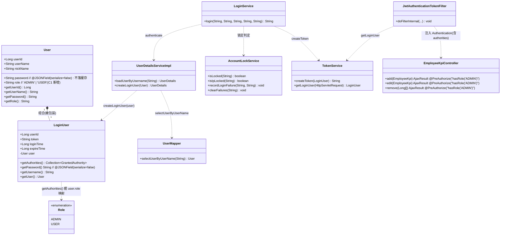
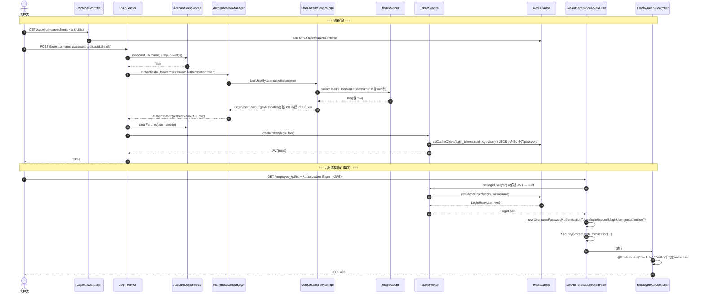
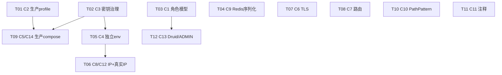

# prj-backend-c 全面整体修复方案与设计

> 架构师：高见远（software-architect）
> 对象：`D:\crh123dexiaohao\server` 下 Spring Boot 后端 `backend/prj-backend-c`
> 现状：已迁移 Boot 2.7→3.2 / jakarta / Spring Security 6 / JDK17，若依(RuoYi)风格单体。源码可编译，迁移 API 适配正确。
> 范围：安全加固、权限与功能修复、迁移正确性、配置与文档治理（问题 C1–C14）。
> 约束：**不修改任何源码**，本文件为设计与任务分解，落地由 Engineer 执行。

---

## 1. 实现方案与框架选型（最小变更原则）

沿用现有技术栈，**不引入新框架、不改启动方式、不改变对外接口契约（除 C7 路由对齐与 C1 权限语义外）**。所有修复以"补全缺失治理项 + 修正错误语义"为主。

| 维度 | 现状 | 选型/原则 |
|------|------|-----------|
| Web / 容器 | Spring Boot 3.2（内嵌 Tomcat）、JDK17 | 不变；用 `server.forward-headers-strategy=native` 解决代理后真实 IP（C12） |
| 安全 | Spring Security 6（`SecurityFilterChain` + `@EnableMethodSecurity`） | 不变；仅修正 `getAuthorities()` 语义与注释 |
| 持久化 | MyBatis + MySQL 8（Druid 连接池） | 不变；C1 用**最小角色列**（不改 mapper 结构，仅加一列一联） |
| 缓存 | Spring Data Redis 3（默认 JDK 序列化） | 新增 `RedisConfig` 改为 `String` key + `GenericFastJsonRedisSerializer` value（fastjson2 已随核心包提供，**零新增依赖**） |
| Token | jjwt 0.12.x（HS256，`Keys.hmacShaKeyFor`） | 不变；C3 仅治理密钥来源与强度 |
| 序列化 | fastjson2（JSON 字段注解已用） | 不变；C9 复用其 `GenericFastJsonRedisSerializer` |
| 网关 | Nginx 1.25-alpine | 不变；C6 增加 443/TLS/安全头，C7 增加后端路径转发 |
| 编排 | docker-compose（base + business-prj + business-prj.dev） | C2/C3/C4/C5/C14 治理 profile / env / 命名 |

**核心设计决策**

- **C1 权限模型**：采用**最小角色列方案（推荐）**——`user_info` 增加 `role VARCHAR(20)`（取值 `ADMIN`/`USER`），`LoginUser.getAuthorities()` 依据 `user.role` 构建 `ROLE_xxx`。当前代码仅有 `hasRole('ADMIN')` 一处语义需求，无需若依式 `sys_role/sys_user_role/sys_menu` 三表（见第 7 节待明确 C1）。
- **C2/C3 生产治理**：新增 `application-prod.yml`（四凭证强默认值 + 全部接 `${ENV}` 占位，缺失即启动失败或强告警），生产 compose 设 `SPRING_PROFILES_ACTIVE=prod`；密钥通过 `env_file`（`.env.prod`）外部化，文档化必填变量。
- **C9 缓存**：新增 `RedisConfig` 覆写 `redisTemplate` Bean 为 JSON 序列化；`User.password` 增加 fastjson2 `@JSONField(serialize=false)`，确保 bcrypt 哈希不落 Redis。
- **C8 锁定**：`AccountLockService` 增加 **IP 维度**失败计数与**递增锁定时长**，与既有用户名维度并存；`LoginService` 传入真实客户端 IP。
- **C12 真实 IP**：`application.yml` 增加 `server.forward-headers-strategy=native`（仅信任 Nginx 这一跳），`CaptchaController` 与锁定逻辑统一从 `X-Real-IP`/`X-Forwarded-For` 解析客户端 IP（新增 `IpUtils.getClientIp`）。

---

## 2. 文件列表（相对仓库根 `server/` 的路径）

### 2.1 新增文件

| 文件 | 说明 | 关联问题 |
|------|------|----------|
| `backend/prj-backend-c/src/main/resources/application-prod.yml` | 生产 profile：四凭证强默认 + 接 `${ENV}`，缺失即失败/强告警；关闭 swagger；接 prod 数据源/redis | C2 |
| `backend/prj-backend-c/src/main/java/com/prj/framework/config/RedisConfig.java` | 覆写 `redisTemplate` 为 `String` 键 + `GenericFastJsonRedisSerializer` 值 | C9 |
| `backend/prj-backend-c/src/main/java/com/prj/common/utils/IpUtils.java` | `getClientIp(HttpServletRequest)`：优先 `X-Forwarded-For`→`X-Real-IP`→`getRemoteAddr()` | C8/C12 |
| `db/mysql_init/migrate_role.sql` | 存量库 ALTER：`user_info` 加 `role` 列；将现有 admin 置为 `ADMIN` | C1 |
| `docker-compose.prod.yml` | **真正的生产** compose：prod profile、强重启策略、外部化密钥(env_file `.env.prod`)、去 `dev-` 前缀、无 TTY/全量挂载 | C5/C14 |
| `.env.backend` | 后端专用 env（**不含 ROOT 口令**）：`SPRING_DATASOURCE_*`、`REDIS_PASSWORD`、`JWT_SECRET`、`DRUID_*`、`AI_API_TOKEN` | C3/C4 |
| `.env.prod` | 生产 env 占位（密钥由用户填真实值，机制搭好） | C2/C3/C5 |

### 2.2 修改文件

| 文件 | 修改点 | 关联问题 |
|------|--------|----------|
| `backend/prj-backend-c/src/main/resources/application.yml` | 增加 `server.forward-headers-strategy=native`；C10 可选移除 `ant_path_matcher`；确认 `token.secret` 仍 `${JWT_SECRET:…}` | C10/C12 |
| `backend/prj-backend-c/.../core/domain/entity/User.java` | 增加 `role` 字段 + getter/setter；`password` 增加 `@JSONField(serialize=false)`（fastjson2） | C1/C9 |
| `backend/prj-backend-c/.../core/domain/entity/User.java` 对应的 `UserMapper.xml` | `resultMap` 增加 `role`；`selectUserByUserName` 增加 `u.role`  select | C1 |
| `backend/prj-backend-c/.../core/domain/model/LoginUser.java` | `getAuthorities()` 由 `user.role` 构建 `ROLE_xxx`（移除硬编码 `ROLE_ADMIN`） | C1 |
| `backend/prj-backend-c/.../framework/web/service/AccountLockService.java` | 增加 IP 维度计数键 `login_fail_ip:` + 递增锁定时长 API | C8 |
| `backend/prj-backend-c/.../framework/web/service/LoginService.java` | `login(...)` 接收 `clientIp`；失败/锁定判定同时按 `username` 与 `ip` | C8 |
| `backend/prj-backend-c/.../controller/CaptchaController.java` | 用 `IpUtils.getClientIp` 替代 `getRemoteAddr()` | C12 |
| `backend/prj-backend-c/.../framework/config/SecurityConfig.java` | 修正 CSRF/Token 注释（实为 Bearer Header）；C7 如需改路径则同步 `requestMatchers` | C7/C11 |
| `backend/prj-backend-c/.../controller/EmployeeKpiController.java` | 若选 C7 方案(a) 则加 `/api` 前缀（方案(b) 不改） | C7 |
| `docker-compose.business-prj.dev.yml` | `env_file` 由 `.env.dev` → `.env.backend`；AI 服务名统一 `dev-prj-llama`；补注释 | C4/C14 |
| `docker-compose.base.yml` | `llama` 服务名统一为 `dev-prj-llama`；密钥经 env 注入，去除对 `.env.dev` 根口令依赖 | C14 |
| `docker-compose.business-prj.yml` | 现状为"命名像 prod 实为 dev"：改写为真实 prod 引用（或直接由 `docker-compose.prod.yml` 取代并更名澄清）；设 `SPRING_PROFILES_ACTIVE=prod` | C2/C5 |
| `gateway/nginx/conf.d/prj.conf` | 增加 443 SSL server + HSTS/CSP；补齐后端根路径转发 allowlist（C7）；保留 80→443 或内网声明 | C6/C7 |
| `gateway/nginx/ssl/` | 放置证书（`prj.crt`/`prj.key`）占位；无证书则按内网降级 | C6 |
| `db/mysql_init/init.sql` | `user_info` DDL 增加 `role` 列；admin 种子数据写 `role='ADMIN'`（新建库即用） | C1/C13 |
| `.env.dev.example` | 拆分为"数据库根账号(.env.db)"与"后端(.env.backend)"概念，去除文档级根口令泄漏误导 | C3/C4 |

---

## 3. 数据结构与接口

### 3.1 C1 角色模型（最小角色列方案）类图

> **RBAC 升级路径（可选，非本次必须）**：若未来需细粒度权限，可演进为 `sys_role` + `sys_user_role` + `sys_menu`，`User` 持 `List~Role~`，`getAuthorities()` 展开为 `ROLE_*` + `PERMISSION_*`（`menu` 权限串）。本次不引入，避免 mapper 联表改造与既有 62 测试的大面积回归。

### 3.2 认证 / 授权调用时序图（登录 → 权限加载 → @PreAuthorize 判定）

---

## 4. 任务列表（按相位 + 依赖，含回归要求）

> 相位：P0 基础治理 → P1 权限模型 → P2 缓存/环境/锁定 → P3 网关/路由/compose → P4 清理。
> "改动认证/授权链路"= 是 的任务，落地后**必须全量回归既有 62 项自动化测试**（P1-4 接口 33 + S8/S9 29），并确保新建库/admin 种子带 `ADMIN` 角色，否则 `hasRole('ADMIN')` 全 403。

| 任务ID | 相位 | 关联 | 任务名 | 涉及文件 | 改动认证/授权链路 | 依赖 | 预估影响 | 回归62 |
|--------|------|------|--------|----------|:---:|------|----------|:---:|
| **T01** | P0 | C2 | 新增生产 profile 与配置 | `application-prod.yml`(新)；`docker-compose.business-prj.yml`(设 prod)；`.env.prod`(新) | 否 | — | 仅生产生效，dev 不受影响；S8 严格模式将在 prod 真正触发 | 否(dev) |
| **T02** | P0 | C3 | 生产密钥治理与变量文档化 | `application-prod.yml`；`.env.backend`(新)；`.env.dev.example`；`docker-compose.*` 引用 | 否 | T01 | 补齐 JWT_SECRET/REDIS_PASSWORD/DRUID_PASSWORD；缺失即启动失败/强告警 | 否 |
| **T03** | P1 | C1 | 引入真实角色模型与权限加载 | `User.java`；`UserMapper.xml`；`LoginUser.java`；`init.sql`；`migrate_role.sql`(新)；`IUserService`(可选) | **是** | — | **高**：`getAuthorities()` 语义变更；admin 须 seed `ADMIN`，否则既有 33 接口测试 + Druid 全 403 | **是(必须)** |
| **T04** | P2 | C9 | Redis 序列化改造 | `RedisConfig.java`(新)；`User.java`(password 注解)；`RedisCache.java`(不动) | 间接(缓存格式) | — | 中高：token/loginUser 缓存序列化格式变更，需重启清缓存；与 T03 并存时确保角色随 LoginUser 正确反序列化 | **是** |
| **T05** | P2 | C4 | 后端独立环境文件(去 ROOT 泄漏) | `.env.backend`(新)；`docker-compose.business-prj.dev.yml`(env_file 切换) | 否 | T02 | 低：仅环境变量来源变化，需验证后端仍能取到 DB/Redis/JWT 等 | 启动验证 |
| **T06** | P2 | C8+C12 | 锁定加 IP 维度 + 真实客户端 IP | `application.yml`(forward-headers)；`IpUtils.java`(新)；`AccountLockService.java`；`LoginService.java`；`CaptchaController.java` | 部分(登录失败/锁定路径) | T05 | 中：登录失败计数键新增 IP 维度；S8/S9/captcha 测试须重跑 | **是(S8/S9/captcha)** |
| **T07** | P3 | C6 | 网关 TLS 与安全头 | `gateway/nginx/conf.d/prj.conf`；`gateway/nginx/ssl/`(证书) | 否 | — | 中：影响对外暴露协议；无证书则降级为内网声明 | 容器路由验证 |
| **T08** | P3 | C7 | 路由契约对齐 | `prj.conf`(后端根路径 allowlist)；或 `EmployeeKpiController.java`+`SecurityConfig.java`(加 /api) | 部分(permitAll 路径) | — | 中：选方案(b)低侵入；选(a)需同步前端调用与 SecurityConfig 白名单 | **是(路由可达)** |
| **T09** | P3 | C5+C14 | 真实生产 compose + 服务名统一 | `docker-compose.prod.yml`(新)；`docker-compose.business-prj.yml`；`docker-compose.base.yml`(llama 名) | 否 | T01,T02 | 中：部署形态变更；统一 `dev-prj-llama` 服务名 | 部署验证 |
| **T10** | P4 | C10 | 可选：回退 PathPatternParser | `application.properties`/`yml`(移除 ant_path_matcher) | 否 | — | 低：仅路径匹配器实现差异，需观察 mapper 路径兼容 | 建议 |
| **T11** | P4 | C11 | SecurityConfig 注释修正 | `SecurityConfig.java`(注释) | 否（注释） | — | 低：无逻辑变更 | 否 |
| **T12** | P4 | C13 | Druid 双保险 + 真实 ADMIN 确认 | `SecurityConfig.java`(保留 /druid/**)；`init.sql`/`migrate_role.sql`(admin=ADMIN，依赖 T03) | 否（依赖 T03 产出） | T03 | 低：确保 `hasRole('ADMIN')` 对真实 admin 生效 | 否 |

**依赖图（mermaid）**

> 说明：P0/P1/P2 多为可并行落地（T03/T04/T06 各自独立改动不同文件），但**统一回归批次**执行。T09 依赖生产配置就绪（T01/T02）；T12 依赖 T03 的 admin 角色种子。

---

## 5. 依赖包列表

**本次修复无需新增任何第三方依赖。**

- `com.alibaba.fastjson2:fastjson2`（已存在）→ 提供 `com.alibaba.fastjson2.support.spring.data.redis.GenericFastJsonRedisSerializer`，用于 C9 的 Redis JSON 序列化。
- 备选（零新增）：`org.springframework.boot:spring-boot-starter-data-redis` 已含 `GenericJackson2JsonRedisSerializer`，亦可选用；本方案统一用 fastjson2 以与现有序列化注解一致。
- JDK17 / Spring Boot 3.2 / Spring Security 6 / MyBatis 3 / MySQL Connector/J 8 / Druid 3-starter / jjwt 0.12.x / kaptcha / pagehelper 2.x（均现状，不动版本）。

---

## 6. 共享知识（跨文件约定，供 Engineer 落地遵循）

1. **角色加载约定**：`user_info.role` 仅存单一角色字面量（`ADMIN`/`USER`）。`LoginUser.getAuthorities()` 统一映射为 `ROLE_` 前缀授权（`ADMIN`→`ROLE_ADMIN`）。所有 `@PreAuthorize("hasRole('ADMIN')")` 仅对 `role='ADMIN'` 用户放行。新增角色须在 `init.sql` 与 `migrate_role.sql` 同步种子。
2. **Redis 序列化约定**：全量缓存对象经 `RedisConfig` 的 `redisTemplate`（String 键 + fastjson2 JSON 值）。**任何存入 Redis 的实体，敏感字段（`User.password` 等）必须加 `@JSONField(serialize=false)` 或 `transient`**，杜绝 bcrypt 哈希落盘。
3. **Profile 约定**：`dev`（默认，宽松，仅 WARN）、`prod`（强校验，四凭证缺失即启动失败/强告警，禁用 swagger）。compose 通过 `SPRING_PROFILES_ACTIVE` 显式指定，**禁止写死 dev 作为生产入口**。
4. **密钥/Env 约定**：后端只从 `.env.backend` 读取所需变量（`SPRING_DATASOURCE_*`、`REDIS_PASSWORD`、`JWT_SECRET`、`DRUID_*`、`AI_API_TOKEN`）；**绝不**通过 `.env.dev` 等含 `MYSQL_ROOT_PASSWORD` 的文件注入后端容器。生产经 `.env.prod` 外部化。
5. **Compose / 服务名约定**：基础设施由 `docker-compose.base.yml` 提供（mysql/redis/nginx/llama）；应用栈分 `dev` 与 `prod` 两个文件。**AI 服务名全局统一为 `dev-prj-llama`**（含 `AI_SERVICE_URL=http://dev-prj-llama:11434`），消除 `llama`/`dev-prj-llama` 漂移。生产容器名去 `dev-` 前缀。
6. **客户端 IP 约定**：凡需客户端 IP（验证码频限、登录锁定），统一调用 `IpUtils.getClientIp(request)`，不得直接用 `request.getRemoteAddr()`；前提 `server.forward-headers-strategy=native` 已开启（仅信任 Nginx 一跳）。
7. **网关约定**：对外仅经 Nginx（80/443）。后端控制器根路径由 Nginx allowlist 显式转发（见 C7）；安全头（X-Content-Type-Options、XSS、Referrer-Policy、HSTS、CSP）统一在 Nginx 层设置。

---

## 7. 待明确事项（关键决策点，需用户拍板；附推荐）

### C1：权限模型 —— 全量 RBAC vs 最小角色列
- **推荐：最小角色列（`user_info.role`）**。理由：当前仅 `hasRole('ADMIN')` 一处语义需求，最小变更、零联表、62 测试回归面最小；若依式三表（sys_role/sys_user_role/sys_menu）属于过度设计，留作未来升级路径（见 3.1）。
- 备选：若产品已规划多角色/细粒度菜单权限，则直接上 RBAC（DDL + 3 实体 + Mapper 联表 + `getAuthorities` 展开权限串），工作量约 3–4 文件增量。

### C2/C3：生产密钥如何提供
- **推荐：本次搭好机制（env_file `.env.prod` + `application-prod.yml` 接 `${ENV}`），并填充"示例强随机占位值 + 醒目注释"，由用户上线前替换为真实值**；缺失即启动失败/强告警（S8 严格模式在生产真正生效）。
- 备选 A：Docker Secret（更优安全性，但需改 compose `secrets:` 与挂载）；备选 B：外部配置中心（Nacos/Consul，偏离当前单体无配置中心现状，不推荐）。

### C6：是否启用 TLS
- **推荐：若能提供证书 → 启用**（443 + `ssl_certificate`/`ssl_certificate_key` + HSTS + CSP）。无证书时**明确声明"仅内网部署，HTTP 可接受"**并在 `prj.conf` 顶部注释固化该决策，避免误暴露公网。
- 需用户确认：证书来源（自签/CA）、域名（`local.prj.com` 还是真实域名）、是否公网暴露。

### C7：控制器路径契约
- **推荐：nginx 兜底转发（方案 b）**——Nginx `prj.conf` 增加后端根路径 allowlist（如 `/employee_kpi`、`/login`、`/logout`、`/captchaImage`、`/druid`、`/v3`、`/swagger-ui`、`/doc.html`），避免改动所有控制器与前端调用，回归风险最低。
- 备选（方案 a）：控制器统一加 `@RequestMapping("/api/...")` 前缀 + `SecurityConfig` 白名单同步 + 前端调用加 `/api`；更规范但需协调前端、改动面大。
- 长期目标：新接口统一走 `/api` 前缀，逐步收敛。

---

## 8. 风险评估（必须评审/回归的任务）

| 风险等级 | 任务 | 风险说明 | 缓释措施 |
|----------|------|----------|----------|
| 🔴 高 | **T03 (C1)** | 改变授权语义；若 admin 未 seed `ADMIN`，则 P1-4 全部 33 接口、`/druid/**` 返回 403，S8/S9 因登录后鉴权失败可能连带异常 | ① `init.sql` + `migrate_role.sql` 双写 admin=`ADMIN`；② T03 落地后**全量回归 62 测试**；③ 单测覆盖 `getAuthorities()` 映射 |
| 🔴 高 | **T04 (C9)** | 改变 Redis 缓存序列化格式；旧 JDK 序列化 token 与新 JSON 不兼容，热升级会解析失败 | ① 上线前清空 Redis（`login_tokens:`/`captcha_codes:`/`login_fail:`）；② 与 T03 同批回归；③ `User.password` 必须 `@JSONField(serialize=false)` |
| 🟠 中 | **T06 (C8/C12)** | 登录失败/锁定路径变更 + IP 维度；S8/S9/captcha 测试断言可能依赖旧键/旧 IP 来源 | ① 保留用户名维度向后兼容；② 重跑 S8/S9/captcha 29 测试；③ `forward-headers-strategy=native` 仅在 Nginx 单跳内网开启，防 IP 伪造 |
| 🟠 中 | **T01/T02 (C2/C3)** | 生产配置语义变更；dev 不受影响，但 prod 启动严格化可能暴露此前被 dev 掩盖的缺失变量 | ① dev 仍 `SPRING_PROFILES_ACTIVE=dev` 不受影响；② prod 做启动冒烟；③ 文档化必填 env |
| 🟠 中 | **T07/T08/T09 (C6/C7/C5)** | 部署形态/路由/网关变更；路由 allowlist 遗漏会导致接口 404/403 | ① T08 与前端联调确认后端路径集合；② 容器内重跑 62 测试确认路由可达；③ C5 生产 compose 与 base 服务名一致 |
| 🟢 低 | **T10/T11/T12 (C10/C11/C13)** | 注释/可选配置/双保险确认，无逻辑风险 | T12 依赖 T03 产出，确保 admin=`ADMIN` 即可 |

**总体回归策略**：将 T03、T04、T06 归为"认证/授权/缓存语义批次"，**必须一次性全量回归 62 测试**；P0/P3/P4 在各自落地后做启动冒烟 + 容器内 62 测试可达性验证。所有改动保持"dev 行为不变、prod 才严格"，降低线上回滚风险。

---

## 附：落地前核对清单（Engineer 执行时逐条确认）

- [ ] `init.sql` 与 `migrate_role.sql` 均将 admin 置 `role='ADMIN'`
- [ ] `LoginUser.getAuthorities()` 不再硬编码 `ROLE_ADMIN`
- [ ] `application-prod.yml` 四凭证缺失即失败/强告警；`SPRING_PROFILES_ACTIVE=prod` 仅在生产 compose
- [ ] `.env.backend` 不含 `MYSQL_ROOT_PASSWORD`；后端 compose `env_file` 指向它
- [ ] `RedisConfig` 生效且 `User.password` 标记不序列化
- [ ] `server.forward-headers-strategy=native` 已开；`IpUtils` 被锁定/验证码使用
- [ ] `AccountLockService` 同时按 `username` 与 `ip` 计数
- [ ] Nginx 转发后端根路径齐全；TLS/安全头按 C6 决策落实
- [ ] `dev-prj-llama` 服务名全局一致
- [ ] 全量 62 自动化测试通过
