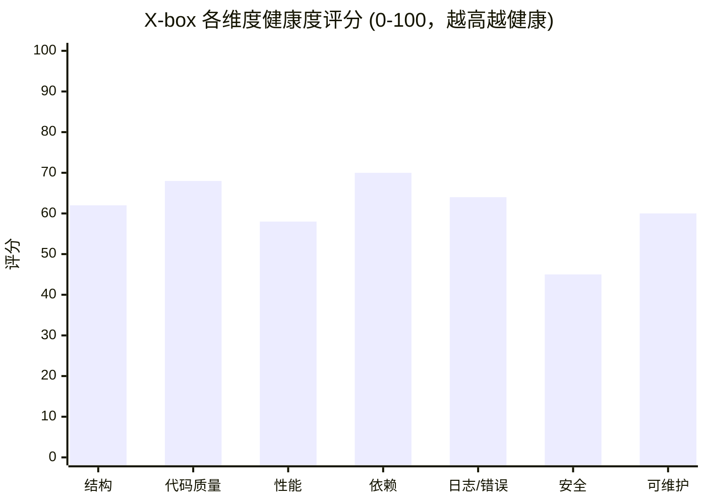

# X-box 项目优化分析报告

> 分析人：架构师 高见远（Gao）　|　日期：2026-07-14
> 范围：多语言微服务单体仓库 `D:\crh123dexiaohao\X-box`
> 方法：基于既有 `docs/code-review-report.md`（寇豆码，IS_PASS=YES，15 项发现）做**扩展与优先级重排**；对 7 个 prior review 未覆盖维度做实地 Read 验证与补充分析。
> 原则：**分析为主，不修改任何生产源代码**（仅给出示意片段/命令）。

---

## 0. 报告摘要（完整版）

X-box 是一个"Java 主干 + 前端 + 网关 + AI 推理 + PHP 遗留模块 + 数据库"的混合 monorepo。核心 Java 栈（Spring Boot 3.2.12 / JDK 17）成熟度较高、安全姿态扎实；**但 `Niu_Txl` PHP 模块存在可被直接利用的 RCE 级漏洞（未鉴权任意文件上传 + 客户端可控上传目录），是全项目最大的安全短板**。前端仍停留在已 EOL 的 Vue 2.6，依赖链无安全补丁通道。版本控制方面，既有 `.gitignore` 已正确屏蔽 `.env*`/`*.pem`/`db/mysql_data/`/`target/`，git 验证确认这些敏感/构建产物**当前并未入库**（prior review 中"已提交私钥/数据/密钥"的论断对当前仓库状态不成立），但磁盘上的 `.env.prod` 仍含弱口令占位、且 `Niu_Txl/` 整个目录处于未跟踪状态。性能方面，`CompareController` 对 Ollama 逐行串行 HTTP 调用是最大瓶颈。

---

## 1. 项目类型与技术栈结论

| 维度 | 结论 |
|------|------|
| 项目类型 | **多语言微服务单体仓库（monorepo）**：一个业务域、多技术栈共存 |
| 后端 | Spring Boot **3.2.12** / JDK **17**；MyBatis3 + Druid3 + Redis(lettuce) + Spring Security + JWT(jjwt 0.12.6) + POI 5.2.3 + fastjson2 2.0.53 + OkHttp4 + PageHelper2 + springdoc 2.3.0 |
| 前端 | **Vue 2.6.12（EOL，2023-12 停更）** + element-ui 2.15.6 + vue-cli 4.4.6（已弃用）+ vuex3 + vue-router3 + axios；构建工具链全面过期 |
| 网关 | Nginx（HTTP 80，TLS 块注释态；CSP 含 `unsafe-eval`） |
| AI 推理 | Docker + Ollama（bge-m3），Java 经 OkHttp 调 `http://dev-prj-llama:11434/api/embeddings` |
| PHP 模块 | **PHP 7.4**（Dreamweaver 生成 + 手写混合），607/902 双站点（留言板/班级相册/作业） |
| 数据 | MySQL 8 + Redis（Docker `prj-mysql`/`prj-redis`） |
| 编排 | `docker-compose.base.yml` / `*.dev.yml` / `*.prod.yml`、`docker/ollama`、`scripts/*.bat` |

**总体判断**：Java 主干满足现代企业级标准；前端与 PHP 模块严重拖后腿，是"现代化主干 + 遗留孤岛"的典型结构。

---

## 2. 整体健康度评分与各维度雷达

> 评分 0–100，越高越健康。安全维度因 PHP RCE 级漏洞被显著拉低。

| 维度 | 评分 | 一句话结论 |
|------|------|-----------|
| 1. 项目结构 | 62 | monorepo 划分合理，但 Niu_Txl 是未跟踪的" rogue 目录"，含中文/空格/引号路径 |
| 2. 代码质量 | 68 | 后端整体良好；CompareController 536 行上帝类、自研 UUID/Base64、PHP 大量副本/重复 conn |
| 3. 性能 | 58 | Ollama 逐行串行 HTTP 调用为头号瓶颈；Excel 无上限；线程每请求派生 |
| 4. 依赖管理 | 70 | 后端版本统一、CVE 已修；kaptcha 风险遗留；前端 Vue2 全栈 EOL |
| 5. 错误处理与日志 | 64 | 后端全局异常处理器完善；PHP `die()` 泄露、无 PII 脱敏、LOGSTASH 未激活 |
| 6. 安全性 | 45 | 后端扎实，但 PHP 模块存在 RCE 利用链、phpinfo 泄露、Dreamweaver DB 控制面 |
| 7. 可维护性 | 60 | 模块成熟度极不齐；Windows-only 脚本；无根级架构文档；中文路径破坏 IDE/部署 |

**整体健康度：58 / 100**（受安全性、性能、可维护性三端拖累；核心 Java 服务实际可达 ~78）。



---

## 3. 与既有评审的关系 & 侦察方法

- 既有 `code-review-report.md` 已覆盖后端/前端源码级安全与缺陷（IS_PASS=YES，15 项，3 项已修）。本报告的**增量贡献**是：
  - (a) 对 prior review "仅记录未改"的 F-04/F-05/F-06/F-07/F-08/F-10/F-11 做**当前仓库状态复核与优先级重排**（部分结论已变化，见各维度）；
  - (b) 补齐 prior review **完全未覆盖**的 6 个维度：结构、代码质量/重复、性能系统分析、依赖（尤其前端 EOL）、日志规范、以及**整个 Niu_Txl PHP 模块**。
- 实地验证方式：`git ls-files` / `git log --all` 校验版本控制真实状态；Read 关键证据文件（见各维度"涉及文件"）。
- **重要更正（交叉验证发现）**：prior review 与任务简报称"`.env.prod` 已提交 / `*.pem` 与 `mysql_data` 已入库 / `target/` 已提交"。经 git 验证，**当前仓库索引与历史均未包含这些文件**（`.gitignore` 已含 `.env*`、`*.pem`、`db/mysql_data/`、`backend/.../target/`，且从未被强制加入）。故"私钥/数据进版本库"的论断对**当前状态不成立**。残留真实风险见维度 1/6。

---

## 4. 七维度详细分析

### 4.1 项目结构优化

| # | 现状问题 | 针对性建议 | 优先级 | 涉及文件 |
|---|---------|-----------|--------|---------|
| S1 | `Niu_Txl/` 整个目录**未纳入版本控制**（`git status` 显示 `?? Niu_Txl/`），且内含高危代码与大量垃圾文件 | 安全修复前**不要**整体 `git add`；先按 4.6 清理高危文件，再决定选择性纳入或加入根 `.gitignore` | P1 | `Niu_Txl/` |
| S2 | 目录含中文+空格+引号：`Niu_Txl/607/Dad‘s/`（弯引号 U+2018）、`Niu_Txl/607/永远的607/` | 重命名为 ASCII（如 `607/dads/`、`607/class607/`），避免 IDE/部署/CI 路径解析失败 | P2 | `Niu_Txl/607/Dad‘s/`、`永远的607/` |
| S3 | `scripts/*.bat` 仅 Windows 可运行（`backup_dev.bat`/`prj_restart.bat`/`prj_stop.bat`），Linux/CI 部署受阻 | 增补 `Makefile` 或 POSIX `scripts/*.sh`，或统一到 `docker compose` 命令 | P2 | `scripts/prj_restart.bat` 等 |
| S4 | 根目录存在游离文件：`_v.html`、`nul`（前者 `?? _v.html` 未跟踪，后者为空文件） | 删除或归入对应模块；`nul` 疑似误生成，直接删除 | P2 | `_v.html`、`nul` |
| S5 | 初始化 SQL `db/class_init/`（msg.sql/work.sql）**未跟踪**（`?? db/class_init/`） | 应纳入版本控制（初始化数据属于可重建交付物），补充提交 | P2 | `db/class_init/` |
| S6 | 缺根级架构文档（ADR/README 说明模块边界、部署拓扑、端口契约） | 增补 `docs/ARCHITECTURE.md` 与 `README.md` | P2 | 仓库根 |

### 4.2 代码质量优化

| # | 现状问题 | 针对性建议 | 优先级 | 涉及文件 |
|---|---------|-----------|--------|---------|
| Q1 | `CompareController` **536 行单类**承担：上传读取 / 向量化 / 比对 / 进度轮询 / Excel 导出，违反单一职责 | 拆分为 `ExcelReaderService`、`EmbeddingService`、`CompareService`、`CompareProgressService`；Controller 仅做编排 | P1 | `backend/.../controller/CompareController.java` |
| Q2 | 自研 `UUID.java`(468 行)、`Base64.java`(292 行)，与 JDK `java.util.UUID`/`java.util.Base64`/Hutool 重复 | 直接替换为 JDK 标准实现（或 Hutool），删除自研类 | P2 | `backend/.../common/utils/uuid/UUID.java`、`common/utils/sign/Base64.java` |
| Q3 | PHP 大量副本/死文件：`* - 副本.php`、`* copy.php`、`index copy.php`、`reply-msg copy.php`、`gd2 copy.php` 等共 **16 个** | 删除所有 `副本`/`copy` 文件，只保留单一权威版本 | P2 | `Niu_Txl/902/**`、`Niu_Txl/607/**` |
| Q4 | `902/message/Connections/conn.php` 与 `902/work/Connections/conn.php` 近乎重复（仅库名 `msg`/`work` 不同） | 抽取共享连接器（读 `CLASS_DB_NAME` 区分），消除重复 | P2 | `Niu_Txl/902/message/Connections/conn.php`、`902/work/Connections/conn.php` |
| Q5 | `UploadServiceImpl.uploadFile` 取扩展名用 `lastIndexOf(".")+1`，当文件无扩展名时 `substring(0)` 得全名、且 `getOriginalFilename()` 为 null 时 NPE | 判空 + 用 `FilenameUtils.getExtension`；无扩展名直接拒绝 | P2 | `backend/.../service/impl/UploadServiceImpl.java:79` |
| Q6 | `pom.xml` 中 `kaptcha 2.3.2` 注释"先保留 2.3.2 验证；若启动报 servlet API 冲突再处理"——已知风险项遗留未决 | 实测启动验证；冲突则升级/替换验证码方案（如 `easy-captcha`/自绘） | P1 | `backend/prj-backend-c/pom.xml:109` |

### 4.3 性能优化

| # | 现状问题 | 针对性建议 | 优先级 | 涉及文件 |
|---|---------|-----------|--------|---------|
| P1 | **Ollama 逐行串行 HTTP 调用**：`batchEmbedding` 在 `for` 循环内逐条 `getSingleEmbedding(text)`（每次一次 `/api/embeddings` 同步 HTTP，readTimeout 60s）。千行 Excel ⇒ 上千次串行网络往返，是头号瓶颈 | ① 改用 Ollama 批处理端点 `/api/embed`（`input:[...]` 数组一次返回全部向量）；② 若必须逐条，则用有界并发（`CompletableFuture` + `Semaphore(8~16)`）替代串行；③ 加 Caffeine LRU 缓存按文本去重 | P0 | `CompareController.java:357-369,378-395` |
| P2 | `matchProcess` 为 O(origin×new) 余弦比较（千×千=1e6 次 1024 维点积），大数据量 quadratic | 可接受的常规规模下保留；超大规模引入近似最近邻（如 FAISS/hnswlib 或分块） | P2 | `CompareController.java:426-506` |
| P3 | **每请求派生线程**：`compareExcel` 的 `finally` 中 `new Thread(...).start()` 做 5 分钟延时清理（F-07，非守护线程，无关闭钩子） | 改为共享 `ScheduledExecutorService`（`@Bean` 单例，`schedule(...,5,MINUTES)`），并注册 JVM 关闭钩子 | P1 | `CompareController.java:210-216` |
| P4 | **Excel 读取无上限**：`WorkbookFactory.create(inputStream)` 无行/单元格上限，对恶意/压缩 xlsx（zip bomb）可 OOM（F-08） | 加硬上限（如 ≤5万行）；`ZipSecureFile.setMinInflateRatio(0.005)` 防 zip bomb；超大文件改 SXSSF/事件模型流式读 | P1 | `CompareController.java:305-329` |
| P5 | Ollama 地址硬编码 `http://dev-prj-llama:11434/api/embeddings`，未走 `AI_SERVICE_URL`（F-10） | 改为 `@Value("${ai.service-url}")` + 默认值，统一 env 注入 | P2 | `CompareController.java:131` |
| P6 | 静态 `ConcurrentHashMap` 缓存（RESULT/PROGRESS）为单 JVM 实例，水平扩容下不一致 | 比对结果改 Redis/Caffeine+TTL，或声明为单实例部署前提 | P2 | `CompareController.java:69-72` |

### 4.4 依赖管理

| # | 现状问题 | 针对性建议 | 优先级 | 涉及文件 |
|---|---------|-----------|--------|---------|
| D1 | 前端 **Vue 2.6.12 EOL**（2023-12 停更），element-ui 2.15.6（已停更，Vue3 应转 Element Plus）、vue-cli 4.4.6（官方弃用，转 Vite）、eslint 7、sass 1.32 均为过期工具链，**无安全补丁通道** | 制定迁移路线：Vue2→Vue3(Composition API) + Vite + Element Plus；分阶段（先构建工具，后框架）。评估工作量 ~ 2–4 人周 | P1 | `web/prj-frontend/package.json` |
| D2 | `kaptcha 2.3.2` 存在 servlet API 冲突隐患（见 Q6） | 升级/替换验证码组件 | P1 | `pom.xml:109` |
| D3 | `poi`/`poi-ooxml` 在 `dependencyManagement` 与 `dependencies` 双重声明（版本一致，冗余）；`gson`/`commons-collections4` 疑似未被直接使用 | 清理未使用依赖，去除重复声明 | P2 | `pom.xml` |
| D4 | 后端依赖版本统一管理良好、CVE 已修（prior review 已确认），无臃肿 | 维持现状，新增依赖走 `dependencyManagement` 锁版本 | — | `pom.xml` |

### 4.5 错误处理与日志

| # | 现状问题 | 针对性建议 | 优先级 | 涉及文件 |
|---|---------|-----------|--------|---------|
| L1 | PHP 大量 `die(mysqli_connect_error())` 把 DB 错误**直接回显客户端**（信息泄露 + 暴露表结构/路径） | 改用统一错误页/`error_log()`，对用户返回泛化错误；非 dev 环境 `display_errors=Off` | P1 | `Niu_Txl/902/message/Connections/conn.php:13`、`902/work/Connections/conn.php:13` |
| L2 | PHP `uploadHandler.php` 调试输出 `var_dump($_FILES); print_r($_FILES);` 泄露 | 删除调试输出 | P0 | `Niu_Txl/607/uploadHandler.php:3-5` |
| L3 | 日志**无 PII 脱敏**：`logback-spring.xml` 仅文本 `%msg%n`，无手机号/身份证/令牌掩码；若开启 DEBUG 级 MyBatis 日志，SQL 参数（可能含 PII）会落盘 | 增加自定义 `Converter` 对手机号(`1\d{10}`)/身份证做掩码；mapper 命名空间保持 INFO/WARN，禁止 DEBUG | P1 | `backend/.../resources/logback-spring.xml` |
| L4 | **结构化日志未激活**：`LOGSTASH` appender 被注释，`json-logs` profile 仅切 console 为 JSON，默认不启用 → ELK 采集落空 | 生产 `SPRING_PROFILES_ACTIVE` 加入 `json-logs`，将 JSON 输出到文件 appender（而非仅 console），接入 Logstash | P2 | `logback-spring.xml:56-63,76-87` |
| L5 | 日志 pattern 无 `traceId`/MDC，跨请求难关联 | 引入 Micrometer Tracing，pattern 加 `%X{traceId}` | P2 | `logback-spring.xml:7` |
| L6 | 后端 `GlobalExceptionHandler` 已完善（prior review 确认），`CompareController.downloadResult` 已正确关闭流 | 维持；补充对 Ollama 调用超时/空响应的业务友好提示 | P2 | `backend/.../controller/CompareController.java:227-295` |

### 4.6 安全性（重点）

| # | 现状问题 | 针对性建议 | 优先级 | 涉及文件 |
|---|---------|-----------|--------|---------|
| SEC1 | **`Niu_Txl/info.php` 全文 `<?php phpinfo(); ?>`**：暴露 PHP 版本/路径/环境变量/扩展 → 严重信息泄露 | **立即删除**或仅限内网 + IP 白名单 | P0 | `Niu_Txl/info.php` |
| SEC2 | **`Niu_Txl/607/uploadHandler.php` 未鉴权任意文件上传→RCE**：① 无身份认证即可上传；② 类型由客户端 `$_FILES["type"]` 判定（可伪造）；③ 文件名 `$text.time().".".$typeArr[1]`，`$text=$_REQUEST["text"]` **未消毒**，无扩展名白名单、无路径穿越防护，`move_uploaded_file` 落 Web 可访问目录 `永远的607/newphoto/`；④ `var_dump` 调试泄露 | 快速止血：加鉴权 + 服务端 `finfo` MIME 校验 + 扩展名白名单 + `basename()` 消毒 `$text` + **随机文件名** + 上传目录禁止 PHP 执行（`.htaccess` `php_flag engine off`）；中远期整体下线/重写为受控服务 | P0 | `Niu_Txl/607/uploadHandler.php` |
| SEC3 | **`Niu_Txl/902/work/admin/fupaction.php` 客户端可控目标目录 + 无校验**：`define("DESTINATION_FOLDER", $_POST['upUrl'])` 直接用客户端 `upUrl` 作落盘目录，`copy($_FILES['file']['tmp_name'], upUrl."/".$newfile)` 无类型/鉴权；且 `echo $_POST['useForm']/prevImg/reItem` 直接拼入 JS → **反射型 XSS + 任意目录写**（RCE 链） | 立即删除或加鉴权 + 服务端固定目录 + 扩展名白名单 + 输出 `htmlspecialchars` | P0 | `Niu_Txl/902/work/admin/fupaction.php` |
| SEC4 | **Dreamweaver `_mmServerScripts/MMHTTPDB.php`/`mysql.php`**：HTTP 端点按 `$_POST['opCode']` 提供 `ExecuteSQL`/`GetTables` 等**通用数据库控制面**，无鉴权；若可达即全库读写 | 从部署中**彻底移除**该目录（仅设计期工具，不应存在于运行时） | P0 | `Niu_Txl/902/message/_mmServerScripts/MMHTTPDB.php`、`902/work/_mmServerScripts/MMHTTPDB.php` |
| SEC5 | **fastjson2 autoType（F-04）**：`RedisConfig` 反序列化 `SupportAutoType` + `WriteClassName`，等价开启 autoType；若 Redis 被写入恶意 `@type` 可触发 gadget 链 RCE | 因 Redis 仅存 `LoginUser` 一类对象，**直接按类型反序列化**消除 autoType 需求；或加 `JSONReader.AutoTypeFilter` 白名单仅允许 `LoginUser` | P1 | `backend/.../framework/config/RedisConfig.java:73,90-91` |
| SEC6 | **磁盘 `.env.prod` 含弱口令**：`MYSQL_ROOT_PASSWORD=QaTest@2026`、`PRJ_DB_PWD=Prj@Dev789`、`CLASS_DB_PWD=QaTest@2026`（且与后端 `StartupSecurityValidator.DEFAULT_WEAK_VALUES` 中的 `Prj@Dev789` 命中 → **prod 严格模式会直接启动失败**）；部分字段为 `<openssl rand ...>` 占位 | 上线前用 `openssl rand -base64 32` 等生成强随机值替换全部口令；该文件已被 gitignore（未入库），但切勿 `git add -f` | P1 | `.env.prod` |
| SEC7 | **XFF IP 伪造（F-05）复核**：prior review 称 nginx 用 `$proxy_add_x_forwarded_for`（追加）可被伪造首 IP；**经核查当前 `prj.conf` 已改为 `proxy_set_header X-Forwarded-For $remote_addr;`（覆盖式）**，边缘已缓解。`IpUtils.getClientIp` 仍取首 IP，属脆弱写法 | 网关覆盖式配置已正确，保持；后端确保 `server.forward-headers-strategy=native` 且仅信任 Nginx 一跳，**禁止后端 8080 直连暴露**；代码侧改用"取最后一个受信代理之后的 IP" | P2（已缓解） | `gateway/nginx/conf.d/prj.conf:43,55,68,80`、`IpUtils.java:44-62` |
| SEC8 | **JWT 非 HttpOnly Cookie + HTTP 明文（F-11）**：前端 `js-cookie` 存令牌（非 HttpOnly），网关仅 HTTP；当前无 XSS 注入点，但令牌可被嗅探/JS 读取 | 启用 TLS（见 SEC9）后令牌改 `Secure`；评估 HttpOnly（需前端改从 header 取 token，当前已走 `Authorization` header，可仅保留 header 方案、Cookie 仅作刷新） | P2 | `web/.../utils/auth.js`、`gateway/nginx/conf.d/prj.conf`（TLS 块） |
| SEC9 | **无 TLS**：`prj.conf` 443/TLS 块全注释，令牌与凭据明文传输 | 生产启用证书 + HSTS（取消注释预留 TLS 块）；内网部署至少保证反向代理前置 TLS | P1 | `gateway/nginx/conf.d/prj.conf:94-118` |
| SEC10 | **CSP 含 `unsafe-eval`/`unsafe-inline`**：dev 注释允许，但需确保 prod overlay 移除 | 生产独立配置移除 `unsafe-eval`/`unsafe-inline`，收紧 `connect-src` | P1 | `gateway/nginx/conf.d/prj.conf:29` |
| SEC11 | **PHP 存储型 XSS 风险**：`add-msg.php`/`reply-msg.php` 将 `textarea`（留言内容）经 `mysqli_real_escape_string` 入库（防 SQLi 良好），但渲染页（`index.php`）大概率未 `htmlspecialchars` 转义 → 存储型 XSS | 复核 `index.php` 输出，统一 `htmlspecialchars($content, ENT_QUOTES, 'UTF-8')`；留言内容做富文本白名单（如 HTMLPurifier） | P1 | `Niu_Txl/902/message/index.php`（待复核）、`add-msg.php`、`reply-msg.php` |
| SEC12 | **空密码兜底**：`$password_conn = getenv('CLASS_DB_PWD') ?: ''`，env 缺失即空密码连库 | 缺失时 `die` 拒绝启动，而非空密码兜底 | P2 | `Niu_Txl/902/message/Connections/conn.php:8`、`902/work/Connections/conn.php:8` |

> 注：prior review 已确认后端 SQL 注入（全 `#{}`）、认证授权（deny-by-default + `@PreAuthorize(ADMIN)`）、敏感信息脱敏（`password` 不序列化）、CORS 白名单、文件上传（扩展名白名单+随机名）、后端依赖 CVE 均为 **OK**，本报告不重复。

### 4.7 可维护性

| # | 现状问题 | 针对性建议 | 优先级 | 涉及文件 |
|---|---------|-----------|--------|---------|
| M1 | 模块成熟度极不齐：Java 企业级 ↔ PHP 7.4 Dreamweaver 遗留，缺乏统一规范/CI | 为 Niu_Txl 设定"下线/重写/隔离"决策；至少独立容器 + 最小权限 + 网络隔离 | P1 | `Niu_Txl/` |
| M2 | 中文/空格/引号目录名破坏 IDE 索引、Git、部署脚本（见 S2） | 重命名为 ASCII | P2 | `Niu_Txl/607/Dad‘s/`、`永远的607/` |
| M3 | 部署脚本仅 `.bat`（Windows），无 POSIX 等价，CI/Linux 服务器无法直接复用 | 增补 `Makefile`/`.sh` 封装 `docker compose` 生命周期 | P2 | `scripts/*.bat` |
| M4 | 缺根级架构/部署文档与 ADR，模块边界、端口契约仅靠注释分散说明 | 增补 `docs/ARCHITECTURE.md`、`README.md`、关键决策 ADR | P2 | 仓库根/`docs/` |
| M5 | `Niu_Txl` 游离于版本控制之外，既非受管也非显式排除 | 安全清理后选择性 `git add` 或加入 `.gitignore` 显式排除 | P2 | `Niu_Txl/`、`.gitignore` |
| M6 | 前端无可测试性设计、无组件单测；后端虽有 `spring-boot-starter-test` 但覆盖率未知 | 前端迁移 Vue3 时补 Vitest；后端补关键服务单测（尤其 Embedding/Compare 逻辑） | P2 | `web/prj-frontend/`、`backend/.../test/` |

---

## 5. 落地路线图（按 P0→P2）

### 5.1 阶段一：紧急止血（仅删除/配置/加固，≤1 天，无需重构）

| 动作 | 类型 | 涉及文件 | 优先级 |
|------|------|---------|--------|
| 删除 `info.php` | 删除 | `Niu_Txl/info.php` | P0 |
| 删除/隔离 `uploadHandler.php`、`fupaction.php`、两个 `_mmServerScripts/` | 删除/禁用 | `Niu_Txl/607/uploadHandler.php`、`Niu_Txl/902/work/admin/fupaction.php`、`Niu_Txl/902/**/_mmServerScripts/` | P0 |
| 移除 PHP 调试 `var_dump`/`print_r` | 配置/代码 | `Niu_Txl/607/uploadHandler.php:3-5` | P0 |
| 用强随机值替换 `.env.prod` 弱口令（`Prj@Dev789`/`QaTest@2026`），**禁止 `git add -f`** | 配置 | `.env.prod` | P1 |
| 确认 `.env.prod`/`*.pem`/`db/mysql_data/`/`target/` 未被跟踪（已验证 ✅；若有误加执行 `git rm --cached`） | 配置核验 | `.gitignore` | P1 |
| `Niu_Txl` 上传目录加 `.htaccess` `php_flag engine off`（若暂不下线） | 配置 | `Niu_Txl/607/永远的607/newphoto/.htaccess` | P0 |
| 清理 16 个 `副本`/`copy` 死文件 | 删除 | `Niu_Txl/**` | P2 |

### 5.2 阶段二：安全与性能加固（需代码重构，1–2 周）

- **SEC5** fastjson2 autoType → 按 `LoginUser.class` 反序列化（去 autoType）— `RedisConfig.java`
- **P1/P3** Ollama 批量/并发调用 + `ScheduledExecutorService` 替换每请求线程 — `CompareController.java`
- **P4** Excel 行数/zip-bomb 上限 — `CompareController.java:readFirstColumnNames`
- **SEC9/SEC10** 启用 TLS + HSTS + 收紧 CSP（prod overlay）— `prj.conf`
- **SEC11** PHP 留言 XSS 转义复核 — `index.php`/`add-msg.php`/`reply-msg.php`
- **L1/L2** PHP 错误不回显 + 关闭 `display_errors` — `conn.php` 等
- **Q1/Q6** CompareController 拆分 + kaptcha 冲突验证 — `CompareController.java`/`pom.xml`

### 5.3 阶段三：现代化与可维护性（中远期，2–6 周）

- **D1** 前端 Vue2→Vue3 + Vite + Element Plus 迁移路线
- **S2/M2** 重命名中文/空格/引号目录
- **M3** POSIX 部署脚本/Makefile
- **M4** 架构文档/ADR
- **Q2** 删除自研 UUID/Base64
- **L3/L4** 日志 PII 脱敏 + 激活结构化日志接入 ELK

---

## 6. 关键示意片段

**SEC5 — 去除 fastjson2 autoType（按类型反序列化）**
```java
// RedisConfig.FastJson2RedisSerializer
@Override
public Object deserialize(byte[] bytes) {
    if (bytes == null || bytes.length == 0) return null;
    // 仅存 LoginUser 一类对象，直接按类型解析，无需 SupportAutoType
    return JSON.parseObject(bytes, LoginUser.class);
}
// 序列化可保留 WriteClassName 或干脆不写类型（单类型场景）
```

**P3 — 共享 ScheduledExecutorService 替代每请求线程**
```java
@Bean(destroyMethod = "shutdown")
public ScheduledExecutorService compareCleanupScheduler() {
    return Executors.newSingleThreadScheduledExecutor(r -> {
        Thread t = new Thread(r, "compare-cache-cleaner");
        t.setDaemon(true); return t;
    });
}
// finally 中：scheduler.schedule(() -> { PROGRESS_CACHE.remove(u); RESULT_CACHE.remove(u); }, 5, TimeUnit.MINUTES);
```

**P1 — Ollama 批量嵌入（一次 HTTP 调用嵌入整列）**
```java
// 改用 POST /api/embed  input:[t1,t2,...] → embeddings:[vec1,vec2,...]
JSONObject req = new JSONObject().fluentPut("model", EMBED_MODEL).fluentPut("input", textList);
// 单个 HTTP 往返替代 N 次；再并行化多批（Semaphore 限流）
```

**SEC2/SEC3 — PHP 安全上传最小改造**
```php
// 仅服务端校验：扩展名白名单 + basename 消毒 + 随机名 + 禁止执行
$ext = strtolower(pathinfo($file['name'], PATHINFO_EXTENSION));
if (!in_array($ext, ['png','jpg','jpeg','gif'])) http_response_code(403); exit;
$name = bin2hex(random_bytes(16)) . '.' . $ext;          // 随机名，杜绝路径穿越
$dest = '/var/www/uploads/' . $name;                      // 服务端固定目录
move_uploaded_file($file['tmp_name'], $dest);
// 并在该目录 .htaccess: php_flag engine off
```

**git 核验命令（验证敏感文件未入库）**
```bash
git ls-files | grep -E '\.env\.prod$|\.pem$|mysql_data/|/target/'   # 预期为空
git log --all --oneline -- .env.prod db/mysql_data/                  # 预期为空
```

---

## 7. 本次未覆盖 / 需 further 信息（留白项）

1. **Niu_Txl 实际部署形态未知**：PHP 7.4 是否经 `Dockerfile.classphp.qa` 容器化？`prj-php` 服务是否在 `docker-compose.*.yml` 中启用？影响 SEC2/SEC3 的止血方式（容器 vs 裸机）。
2. **`index.php` 渲染是否转义**：仅静态审阅 `add-msg.php` 入库逻辑，未 Read `Niu_Txl/902/message/index.php` 输出逻辑，存储型 XSS（SEC11）需复核渲染端。
3. **ELK/Logstash 实际采集管道**：`logback-spring.xml` 的 JSON 输出目标（Logstash 地址、索引、字段映射）未在仓库中，无法判断结构化日志是否真正可用。
4. **Ollama 部署规模与吞吐**：bge-m3 在 `dev-prj-llama` 的并发上限未知，影响 P1 并发度（Semaphore 取值）与批量嵌入收益评估。
5. **`db/class_init/init.sql` 与 `.env.prod` 库名一致性**：prior review 提到 `init.sql` 实际创建 `prj_dev`，需与 `MYSQL_DATABASE=prj_dev` 核对，避免启动失败（属部署域，本报告未深入）。
6. **前端实际运行态**：`web/prj-frontend/src` 未逐文件审阅（prior review 已覆盖安全面），Vue3 迁移工作量评估需结合组件规模进一步盘点。
7. **git 历史是否曾含敏感文件**：已用 `git log --all` 验证当前无，但若历史曾被 force-push 改写则不可见；公有仓库场景下仍建议对 `.env.prod` 弱口令做轮换（纵深）。
8. **`test_data/`、`logs/` 内容与合规性**：未审阅，建议确认不含生产 PII。

---

*报告结束。所有建议均基于实地 Read 验证，未修改任何生产源代码。*
