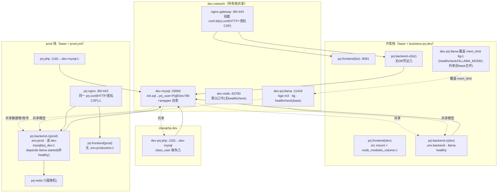
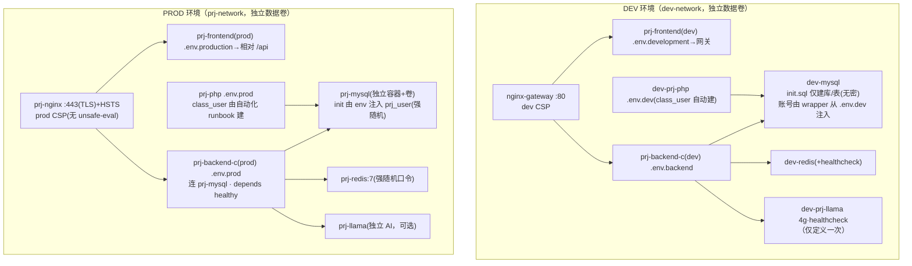

# X-box 容器化全栈项目 — 架构/配置巡检评审报告

> 评审人：高见远（架构师）　|　评审对象：`D:\crh123dexiaohao\X-box\`
> 方法：基于主理人已采集证据 + 直接 Read 复核关键文件（compose / env / SQL / 网关 / Dockerfile / wrapper / devcontainer）后的独立判定。
> 结论先行：**P0 三项均为真且会直接导致生产栈无法启动或密钥入仓；另有若干被高估项与遗漏项，见第 5 节。**

---

## 1. 风险登记册

> 严重度：P0=阻断生产/密钥泄露；P1=连通性或一致性缺陷（开发/生产功能受损）；P2=强化项/技术债。
> 类别：密钥 / 编排 / 网络 / 数据 / 构建 / 一致性。

| 编号 | 严重度 | 类别 | 涉及文件:行 | 根因 | 影响 | 修复建议 |
|------|--------|------|-------------|------|------|----------|
| R-01 | P0 | 数据/密钥 | `.env.prod:20-22`；`db/mysql_init/init.sql:25`；`docker-compose.prod.yml:100,104` | 生产复用 base 的 `dev-mysql`，其 `prj_user` 口令由 init.sql 固化为 `Prj@Dev789`；而 `.env.prod` 的 `SPRING_DATASOURCE_PASSWORD` 为强随机 `<REDACTED-live-prod>`，二者不一致。wrapper 的 `ensure_app_user` 读的是 `.env.dev`（`Prj@Dev789`），救不了 prod。 | 生产后端连库 **Access denied**，prod 栈起不来。 | 给 prod 独立 MySQL（见目标拓扑）；若临时止血，在 `dev-mysql` 上 `ALTER USER 'prj_user'@'%' IDENTIFIED BY '<.env.prod 的强随机>'` 并保持 R2 文档约束（脆弱，不推荐）。 |
| R-02 | P0 | 编排/网络 | `docker-compose.prod.yml:21-22` vs `:24-34`、`:100`、`:113-115`、`:168-170` | 文件头注释自称“自包含、不依赖 base”，正文却要求与 base 一并启动、复用 `dev-mysql`/`dev-network`；`prj-backend-c` 与 `prj-php` 额外 join `dev-network` 跨网访问。 | 生产无环境隔离：dev 重置会清空 prod 数据；prod 与 dev 共用数据卷/网络/AI 服务，安全边界失效。 | prod 拆出独立 `prj-mysql` + `prj-network`，彻底移除对 `dev-*` 的依赖（目标拓扑）。 |
| R-03 | P0 | 密钥 | `.gitignore:28-30`（显式保留 init.sql）；`db/mysql_init/init.sql:25,52-53` | init.sql 被故意纳入版本控制，且含明文 `CREATE USER 'prj_user'@'%' IDENTIFIED BY 'Prj@Dev789'` 与 admin 的 BCrypt(admin123)。`.env.dev` 虽被 `.env*` 屏蔽，但同口令经 init.sql 泄露入仓。 | 凭据入 Git，违反“不能上传 GIT”要求；dev 口令长期暴露。 | **从 init.sql 删除硬编码账号/口令**，仅保留建库+表+种子；账号由现有 `docker-entrypoint-wrapper.sh:ensure_app_user`（已按 env 幂等建号）注入。init.sql 回归“无密”化。 |
| R-04 | P1 | 构建/一致性 | `.env.prod`（实测 GBK，中文注释全乱码） | 文件为 GBK 编码，ASCII 变量值仍可解析，但维护性与可移植性差；且口令含 `$ # /` 等特殊字符，若被 `${...}` 插值引用极易断裂。 | 维护者误编辑易损坏；git 可能按二进制处理；变量插值脆弱。 | 转 UTF-8（去 BOM），并复核特殊字符口令是否会被 dotenv 插值（必要时用单引号包裹）。 |
| R-05 | P1 | 编排 | `docker-compose.base.yml:80-116`；`docker-compose.business-prj.yml:68-92` | `dev-prj-llama` 在两份文件重复定义。⚠**纠正主理人**：Compose 多文件合并对 `environment`/`healthcheck` 是**深合并**，对 `mem_limit` 等单值是**覆盖**。故被覆盖的仅是 `mem_limit`（4g→6g）；`OLLAMA_MODEL=bge-m3:latest` 与 `healthcheck` 由 base 保留、并未丢失；logs 卷也仍在（两份都挂）。 | 真实风险 = **llama 在 WSL 8G 下占 6g**（见 R-17 OOM），以及双定义带来的维护歧义。 | 仅在 base 定义一次 `dev-prj-llama`；business-prj.yml 删除该服务块（或仅用 `mem_limit` 覆盖需显式标注）。 |
| R-06 | P1 | 数据/编排 | `docker-compose.business-prj.yml:32-65` | “DEV/内网栈”后端 `prj-backend-c` **无 env_file、environment 中无 `SPRING_DATASOURCE_USERNAME/PASSWORD`**（仅 `SPRING_DATASOURCE_URL`）。⚠纠正：该服务 **REDIS 口令是有的**（`REDIS_PASSWORD:${REDIS_PASSWORD:-...}` 与 redis 默认一致），真正缺失的只是 **DB 账号/口令**。 | 该栈后端连 MySQL 鉴权失败（缺用户名/口令）。该文件与 business-prj.dev.yml 功能重叠，疑似遗留。 | 要么废弃 business-prj.yml（统一用 business-prj.dev.yml），要么补 `env_file: .env.backend` 或显式 `SPRING_DATASOURCE_USERNAME/PASSWORD`。 |
| R-07 | P1 | 构建 | `docker-compose.business-prj.dev.yml:18-23` | 前端挂载命名卷 `node_modules_volume:/app/node_modules`，空卷会**遮蔽**镜像内 `npm install` 装好的依赖。 | 首启 `npm run dev` 报 `vue-cli-service: not found`。 | 首跑在容器内执行一次 `npm install`；或改用 build 阶段固定依赖、开发期用 `cached` 绑定源码而非整卷覆盖 `node_modules`。 |
| R-08 | P1 | 网络/一致性 | `web/prj-frontend/.env.development:8`（已核实**无** `.env.production`/`.env.prod`） | 开发 API 直连 `http://localhost:8080`（绕过网关）；且生产构建缺 `.env.production` → `VUE_APP_BASE_API` 在 prod build（NODE_ENV=production 仅加载 `.env.production`/`.env`）下为 `undefined`。 | 生产前端 `npm run build` 产物 API 基址错误；且 prod 后端未映射 8080 到宿主机，直连 `localhost:8080` 必失败。 | 新增 `web/prj-frontend/.env.production`，`VUE_APP_BASE_API` 设为相对路径（经网关 `/api`）或 `http://localhost/api`；prod 前端一律走网关。 |
| R-09 | P1 | 数据 | `db/class_init/msg.sql`、`work.sql`；`docker-compose.classphp.dev.yml:16-23`、`docker-compose.prod.yml:140-170` | 607/902 以 `class_user` 连 `dev-mysql`，但 **class_user 账号从未被创建/授权**；`msg.sql/work.sql` 仅建 `msg`/`work` 库与 `admin_user`，不在 `initdb.d`，需手动 runbook。 | 607/902 站点连库 `Access denied for 'class_user'@'...'`，功能不可用。 | 在 dev-mysql 自动化初始化或 runbook 中 `CREATE USER 'class_user'@'%' IDENTIFIED BY '<强随机>'` + `GRANT` 对应库；并把 class_init 纳入可重复执行的初始化。 |
| R-10 | P1 | 数据/一致性 | `db/class_init/msg.sql:22,40-41`、`work.sql:22,40-41` | 2016 phpMyAdmin 老语法；库/表字符集 `utf8`（非 `utf8mb4`），emoji 会被截断；`admin_user.password` 为 **明文** `varchar(20)` `'20091010xuyi'`。 | 明文存口令、字符集不兼容现代数据；历史包袱。 | 迁 `utf8mb4`；口令改哈希存储；清理 2016 语法。 |
| R-11 | P1 | 编排 | `docker-compose.prod.yml:106-112` | prod 后端对 `mysql` 仅 `service_started`、`dev-prj-llama` 仅 `service_started`（非 `healthy`）。base 虽为 llama 配了 healthcheck，但 prod 未利用。 | 模型未拉取/库未就绪时后端即启动，运行时 `/api/embeddings` 404、首查失败。 | prod 对 mysql/llama 改用 `service_healthy`（或 prod 自带 AI 服务并配 healthcheck）。 |
| R-12 | P1 | 一致性 | `docker-compose.prod.yml:31`（注释“建库 prj_prod/msg/work”）vs `:100`（`${MYSQL_DATABASE:-prj_prod}`，实际 `.env.prod:16`=prj_dev） | 注释/runbook 称建 `prj_prod`，但后端实际连 `prj_dev`（来自 `.env.prod` 的 `MYSQL_DATABASE`）。 | 运维按 runbook 建 `prj_prod` 后后端根本不用，造成“库建了却连不上/连错”的 confusion。 | 统一为 `prj_dev`（与 init.sql/R1 一致）并修正注释；或彻底切 `prj_prod` 时同步改 init.sql 与所有引用。 |
| R-13 | P2 | 构建 | `Dockerfile.classphp.qa:1`（"QA TEMP COPY"） | 临时 QA 副本残留于仓库根。 | 镜像构建上下文污染、易误用。 | 删除 `Dockerfile.classphp.qa`（已核实存在）。 |
| R-14 | P2 | 一致性 | `.devcontainer/devcontainer.json:16` | `forwardPorts` 含 `5005`，但 compose 注释已移除 JDWP；该端口实际无监听。 | 误导开发者以为可远程调试。 | 移除 `5005`，或真正需要时显式配 `-Dspring-boot.run.jvmArguments` 调试参数。 |
| R-15 | P2 | 构建 | 根 `.dockerignore`（未排除 `Niu_Txl/`）；后端 `Dockerfile.prod` context=`.` | 后端多阶段构建上下文为仓库根，`Niu_Txl`（~1.8GB 个人媒体）被纳入，拖慢构建。前端 `Dockerfile.prod` context=`./web/prj-frontend` 不受影响。 | 后端镜像构建缓慢、上下文臃肿。 | 根 `.dockerignore` 增加 `Niu_Txl/`（与 `.gitignore` 的二进制排除对齐）。 |
| R-16 | P2 | 编排 | `docker-compose.base.yml:60-77`（redis 无 healthcheck） | dev redis 仅 `service_started` 依赖；无健康探测。 | 若某服务改 `service_healthy` 会卡住；redis 未就绪时后端连不上仅靠重试。 | 给 dev redis 加与 prod 同款的 `healthcheck`。 |
| R-17 | P2 | 编排 | `docker-compose.base.yml` + `business-prj.dev.yml` + `business-prj.yml` 的 mem_limit | WSL 限 8G。base 仅 llama 4g 时：nginx .25+ mysql 1+ redis .5+ llama 4+ backend 2+ frontend 1 ≈ **8.75g > 8G**；business-prj.yml 把 llama 抬到 6g 更直接爆。 | 高概率 OOM kill（llama 或后端）。 | llama 限 4g 且错峰；或把 AI 推理移到宿主机/独立机器；WSL 适当提内存；明确“不同时起全栈”的 SOP。 |
| R-18 | P2 | 网络/安全 | `gateway/nginx/conf.d/prj.conf:10,29`（仅 listen 80；CSP 含 `unsafe-eval`、`connect-src 127.0.0.1:*`）；`docker-compose.prod.yml:47-49` 挂载同一 conf | dev 与 prod 网关**共用同一 prj.conf**：prod 也是 HTTP-only 且沿用 dev 宽松 CSP（`unsafe-eval` 放大 XSS）。TLS server 块仍为注释态。 | 生产缺少传输加密与严格 CSP。 | 拆分 `prj.dev.conf` / `prj.prod.conf`（prod 去 `unsafe-eval`、收紧 `connect-src`、启用 443+TLS+HSTS）。 |
| R-19 | P2 | 密钥 | `db/mysql_init/init.sql:52-53`（admin BCrypt 对应 `admin123`） | 默认管理员弱口令 `admin123`，且哈希随 init.sql 入仓。 | 若 anyone 复用默认 admin，易被攻破。 | 首次部署强制改密；或移除默认 admin、改为部署期注入。 |
| R-20 | P2 | 数据 | `db/class_init/msg.sql:40-41`、`work.sql:40-41` | `admin_user.password` 明文 `20091010xuyi`。 | 明文口令泄露即失陷。 | 改为哈希存储（归属 R-10 一并处理）。 |
| R-21 | P2 | 一致性 | `.env.dev`（无 `REDIS_PASSWORD`）；`docker-compose.base.yml:73`（redis 读 `${REDIS_PASSWORD:-...}` 来自自动加载的 `.env`，非 `.env.dev`） | redis 口令实际来自 compose 自动加载的 `.env`（缺省走默认 `redis_default_pass_change_me`），而 `.env.dev` 根本没有 `REDIS_PASSWORD`。在 `.env.dev` 里配 `REDIS_PASSWORD` **对 redis 无效**。 | 配置来源错位，易误判“已设口令”。 | 统一口令来源：要么在 `.env`（自动加载）设 `REDIS_PASSWORD`，要么让 redis 也 `env_file:.env.dev`；并在 `.env.dev.example` 补全该变量消除漂移。 |
| R-22 | — | 已核实/非风险 | `backend/prj-backend-c/settings.xml`（已核实存在）；`Dockerfile.dev:18`/`Dockerfile.prod:21` 引用 | 主理人曾标注“需确认 settings.xml 是否存在，否则构建失败”。 | **已核实 settings.xml 存在**，后端 dev/prod 构建不因该文件失败。 | 无需处理（记录澄清）。 |

---

## 2. 当前架构拓扑图（Mermaid）

---

## 3. 目标架构拓扑图（Mermaid，建议修正形态）

**目标形态要点**
- prod 与 dev 各自独立 MySQL / 网络 / 数据卷，互不共享 `dev-mysql`/`dev-network`。
- AI 服务在 base 仅定义一次；prod 用独立 `prj-llama`（或同样单定义）。
- 密钥治理：仓库仅提交 `.env.*.example` 模板；真实 `.env.*` 被 `.gitignore` 屏蔽；init.sql **不再含任何口令**（账号由 wrapper/启动脚本按 env 注入）。
- 网关配置按环境拆分（dev/prod），prod 启用 TLS + 严格 CSP。
- 前端补齐 `.env.production`，统一经网关访问。

---

## 4. 分阶段修复序列

### Phase 0 — 止血 / 密钥（立即，阻断泄露与误启）
1. **清除入仓凭据**：从 `db/mysql_init/init.sql` 删除硬编码 `CREATE USER ... IDENTIFIED BY 'Prj@Dev789'` 与 admin 明文/哈希；账号改由 `docker-entrypoint-wrapper.sh:ensure_app_user` 按 `.env.dev` 注入（已具备）。提交后 `git log`/历史中若已含口令，需 rotate 并清理历史（BFG）。
2. **冻结 prod 误启**：在 `.env.prod`/runbook 明确“prod 必须先完成 Phase1 隔离再起”，避免拿 dev 基础设施当生产用。
3. **CRLF 守卫**：确认所有 `.env*` 为 LF（wrapper 已对 MySQL 凭据 strip `\r`，但补充校验避免 redis/AI 侧踩坑）。
4. **默认 admin 强改**：部署期强制改 `admin123`。

### Phase 1 — 编排与连通性（解决 P0 + 关键 P1）
5. **prod 独立 MySQL/网络（R-01/R-02）**：在 prod.yml 增加 `prj-mysql`（独立卷 + 用 env 注入 `prj_user` 强随机口令），`prj-backend-c`/`prj-php` 退出 `dev-network`，仅留 `prj-network`；移除对 `dev-mysql`/`dev-prj-llama` 的依赖。
6. **单一定义 AI 服务（R-05）**：删除 business-prj.yml 中重复的 `dev-prj-llama`，仅 base 保留（4g）。
7. **business-prj.yml 后端补 DB 凭证（R-06）** 或直接废弃该文件，统一用 business-prj.dev.yml。
8. **class_user 供给（R-09/R-10/R-20）**：自动化初始化或 runbook 中创建 `class_user@'%'` + 授权 `msg`/`work`；`class_init` 迁 `utf8mb4`、口令改哈希。
9. **prod 等待条件修正（R-11）**：`depends_on` mysql/llama 改 `service_healthy`。
10. **注释/库名对齐（R-12）**：统一 `prj_dev` 并修正 prod.yml 注释。

### Phase 2 — 构建与一致性（P1/P2 收口）
11. **前端生产 env（R-08）**：新增 `web/prj-frontend/.env.production`，`VUE_APP_BASE_API` 走网关相对路径。
12. **node_modules 策略（R-07）**：首跑容器 `npm install`，或调整挂载方式避免遮蔽镜像依赖。
13. **`.dockerignore` 加 `Niu_Txl/`（R-15）**。
14. **`.env.prod` 转 UTF-8（R-04）** 并复核特殊字符。
15. **网关配置拆分（R-18）**：`prj.dev.conf` / `prj.prod.conf`，prod 去 `unsafe-eval`、收紧 CSP。
16. **WSL 内存预算（R-17）**：llama 限 4g、错峰、必要时外置推理。
17. **清理技术债（R-13/R-14/R-16）**：删 `Dockerfile.classphp.qa`、devcontainer 去 `5005`、dev redis 加 healthcheck。
18. **REDIS 口令来源对齐（R-21）**：统一到 `.env`（自动加载）或让 redis `env_file:.env.dev`，补全 `.env.dev.example`。

### Phase 3 — 强化（生产就绪）
19. **传输安全**：prod 启用 443 + TLS + HSTS（已预留 server 块）。
20. **密钥管理**：引入外部密钥管理（Vault / 云 Secrets），运行时注入，杜绝 `.env.prod` 落地。
21. **可观测性**：统一健康检查语义（started vs healthy）、日志聚合、资源监控告警（尤其 llama 内存）。
22. **合规复核**：CI 中加 secret 扫描（gitleaks）与 compose 校验，防止再次把凭据/大文件引入仓库。

---

## 5. 对主理人分析的纠错、过度推断与遗漏

### 5.1 需纠正（主理人分析有误）
- **P1-E 高估**：称 business-prj.yml 对 `dev-prj-llama` 的“双重定义被后者覆盖，healthcheck/OLLAMA_MODEL/logs 丢失”。**不实**。Docker Compose 多文件合并对 `environment` 与 `healthcheck` 是深合并、对 `mem_limit` 等单值是覆盖。实测：base 的 `OLLAMA_MODEL=bge-m3:latest` 与 `healthcheck` 在合并后**保留**；logs 卷两份都在（base `:app/logs/llama` + biz `:app/logs`）。**唯一真实覆盖是 `mem_limit` 4g→6g**（这才是 WSL OOM 的元凶）。修复方向应是“只在 base 定义一次 llama”，而非“补回 healthcheck/OLLAMA_MODEL”。
- **P1-F 表述偏差**：称该后端“无 DB 凭证、REDIS_PASSWORD 缺省走默认”。实际 **REDIS 口令是有的**（与 redis 默认一致，连通正常），缺失的仅 `SPRING_DATASOURCE_USERNAME/PASSWORD`。建议将风险精确收窄为“缺 DB 账号/口令”。

### 5.2 过度推断（影响不大但应降温）
- 无。其余 P0/P1/P2 项均与文件证据一致。

### 5.3 遗漏（主理人未列出，建议补入）
- **R-03 的更优修复（O1）**：init.sql 的硬编码 `CREATE USER` 与本就存在的 `wrapper.ensure_app_user`（按 env 幂等建号）**功能重复**。既然账号可由 wrapper 从 gitignored 的 `.env` 注入，init.sql 应回归“仅建库/表/种子”，从根本上消除凭据入仓——比“改 .gitignore”更干净。
- **R-18 根因（O2）**：prod 与 dev 共用同一 `prj.conf` 是“prod 仍 HTTP + dev 宽松 CSP”的根因，应在评审中明确为单点配置耦合，而非仅记为“未实现 overlay”。
- **R-10/R-20 明文口令（O3）**：`msg.sql/work.sql` 的 `admin_user.password` 明文 `20091010xuyi` 是明文存储缺陷，值得单列。
- **R-12 库名注释错位（O4）**：prod.yml 注释说“建库 prj_prod”，后端实际连 `prj_dev`，易误导运维建错库。
- **R-11 等待条件（O5）**：prod 对 mysql/llama 仅 `service_started`（不用 base 已配的 healthcheck），导致模型/库未就绪即起后端。
- **R-21 口令来源错位（O6）**：redis 口令读 compose 自动加载的 `.env`（默认），而 `.env.dev` 无 `REDIS_PASSWORD`——在 `.env.dev` 设该变量对 redis 无效，属配置来源错位的隐性坑。
- **R-22 已澄清（O7）**：`backend/prj-backend-c/settings.xml` 经核实**存在**，主理人“否则构建失败”的疑虑不成立，记录为已排除风险。

### 5.4 一句话总评
P0 三项（prod 连库口令不一致、prod 强依赖 dev 基础设施、init.sql 凭据入仓）均为真且高危，必须优先处理；P1-E 关于 llama 双定义“丢失 healthcheck/OLLAMA_MODEL”的判断不成立（仅 mem_limit 被覆盖），其余判定准确；补充项集中在“密钥治理闭环（init.sql 去密）”与“配置来源/注释一致性”。
