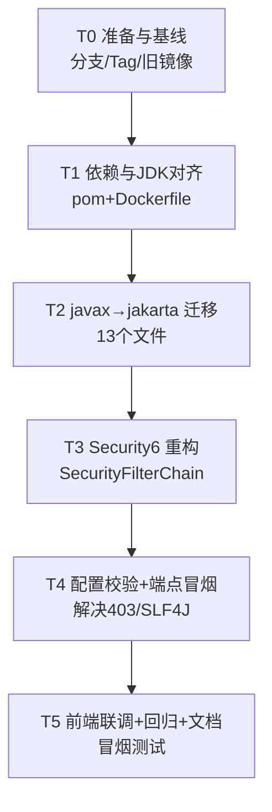

# Spring Boot 2.7.18 → 3.2.x 升级影响面评估与任务分解

> 评估人：架构师 高见远（software-architect）
> 范围：`backend/prj-backend-c`（Boot 2.7.18 / Java 11）、`web/prj-frontend`（Vue 2.6，确认零影响）、编排文件与 Dockerfile
> 性质：**只读评估，未修改任何代码**

---

## 1. 升级影响面总览

| 维度 | 风险 | 说明 |
|------|------|------|
| 依赖版本对齐 | **高** | 至少 8 个核心依赖需改版本/改 artifactId（springdoc、druid、pagehelper、mybatis、mysql、logback、logstash、jaxb），其中 druid 必须换 `druid-spring-boot-3-starter`，否则 StatViewServlet 在 jakarta 下启动即崩 |
| `javax.*` → `jakarta.*` 迁移 | **中** | 13 个 Java 文件含 `javax.` 引用（servlet/validation/annotation），机械替换即可；`javax.crypto`、`javax.imageio` 属 Java SE，**不可替换** |
| Spring Security 6 范式重构 | **高** | `SecurityConfig` 继承 `WebSecurityConfigurerAdapter`（已移除）→ 改为 `SecurityFilterChain` @Bean；`authorizeRequests`→`authorizeHttpRequests`、`antMatchers`→`requestMatchers`；配置不当直接导致 403 |
| 日志栈（SLF4J 2.0 + Logback） | **高** | Boot 3 迁移到 SLF4J 2.0 + Logback 1.4/1.5。当前显式锁定 `logback 1.2.13`（SLF4J 1.7 线）+ `logstash-logback-encoder 6.6`，**不升级会导致启动期 SLF4J provider 不匹配而失败** |
| Druid 控制台 | **高** | `stat-view-servlet` 基于 `javax.servlet.HttpServlet`，必须用 jakarta 迁移版 starter |
| kaptcha 验证码 | **低→中** | `kaptcha 2.3.2` 仅被 `Producer` 路径使用（不加载 `KaptchaServlet`），理论可继续运行；但其传递依赖 `javax.servlet-api` 会与 jakarta 并存，需启动验证 |
| 前端模块 | **低（零代码改动）** | axios `baseURL=process.env.VUE_APP_BASE_API`（dev 为空=同源），devServer proxy 用容器名 `prj-backend-c:8080`，无硬编码 IP/端口；`npm run build` 产物为纯静态，无 Java 侧硬依赖 |
| 数据库/Redis | **低** | MySQL 8.0、Redis 5.0.14 连接参数命名空间在 Boot 3 不变；schema 不受影响 |
| 测试 | **高（无防护）** | 后端 0 测试、前端 0 测试，升级后只能靠端点冒烟 + `StartupSecurityValidator` fail-fast 兜底 |

**结论**：后端为**中高风险**升级，集中在依赖矩阵 + Security 重构 + 日志栈对齐三处；前端与编排（除 Dockerfile JDK 版本）可基本不动。

---

## 2. 依赖版本矩阵

> 目标取 Spring Boot **3.2.12**（3.2.x 末个补丁版；实施时以镜像仓库最新 3.2.x 为准）。Spring Security 6.2.x 由 Boot 3.2 父 POM 统一管理，**无需单独声明**。

| 组件 | 当前版本 | 目标版本 | 说明 / 风险 |
|------|----------|----------|------------|
| `spring-boot-starter-parent` | 2.7.18 | **3.2.12** | 父 POM，牵动全部托管版本 |
| `java.version` / `maven.compiler` | 11 | **17** | pom `<properties>` 中 `11`→`17` |
| `springdoc-openapi-ui` | 1.7.0 | **springdoc-openapi-starter-webmvc-ui:2.3.0** | ⚠️ artifactId 改名；2.x 兼容 Boot 3.2（2.6+ 需 Boot 3.3+，勿用） |
| `mybatis-spring-boot-starter` | 2.2.0 | **3.0.3** | 3.x 适配 Boot 3 / Spring 6 |
| `mysql-connector-java` | 8.0.33 | **com.mysql:mysql-connector-j:8.0.33** | ⚠️ 包名由 `mysql:mysql-connector-java` 改为 `com.mysql:mysql-connector-j`（Boot 3 管理） |
| `druid-spring-boot-starter` | 1.2.23 | **com.alibaba:druid-spring-boot-3-starter:1.2.23** | ⚠️ artifactId 改名 + jakarta 迁移版；**否则 StatViewServlet 启动失败** |
| `pagehelper-spring-boot-starter` | 1.4.6 | **2.1.0** | 2.x 适配 Boot 3（配置项 `pagehelper.*` 兼容） |
| `spring-boot-starter-validation` | 2.7（托管） | 3.2（托管） | 自动引入 `jakarta.validation` 3.0 |
| `spring-boot-starter-data-redis` | 2.7（托管） | 3.2（托管） | Lettuce 客户端；无 Jedis 特化配置，兼容 |
| `spring-boot-starter-security` | 2.7（托管） | 3.2（托管） | 拉起 Security 6.2.x |
| `jjwt` (api/impl/jackson) | 0.12.6 | **0.12.6（不变）** | 已兼容 Boot 3，无 javax 依赖 |
| `kaptcha` | 2.3.2 | **2.3.2（先保留验证）** | 仅用 Producer，不加载 Servlet；若启动报 servlet 冲突则换 jakarta 兼容 fork 或自研 |
| `fastjson2` | 2.0.53 | 2.0.53（建议升 2.0.43+） | jakarta 兼容，非阻塞项 |
| `logback-core / classic / access` | 1.2.13 | **移除显式锁版（交 Boot 托管 1.4/1.5）** | ⚠️ **必须**，否则 SLF4J 2.0 provider 不匹配 |
| `logstash-logback-encoder` | 6.6 | **7.4** | 6.x 仅配 logback 1.2/SLF4J1.7；7.x 配 SLF4J 2 |
| `log4j-api` | 2.17.2 | 2.23.1（建议） | CVE，非阻塞 |
| `commons-io` | 2.11.0 | 2.16.1（建议） | CVE，非阻塞 |
| `javax.xml.bind:jaxb-api` | 无版本直接依赖 | **移除**（代码无 JAXB 用法） | grep 全仓无任何 `javax.xml.bind` 引用，纯冗余；若运行期真需再加 `jakarta.xml.bind:jakarta.xml.bind-api:4.0.1` |
| `poi` / `poi-ooxml` | 5.2.3 | 5.2.3（不变） | Jakarta 中立 |
| `okhttp` | 4.12.0 | 4.12.0（不变） | Jakarta 中立 |
| `gson` / `commons-lang3` / `commons-collections4` | 当前 | 不变（或交 Boot 托管） | 无影响 |

---

## 3. 需改动文件清单

### 3.1 配置/构建类（影响最大）

| 相对路径 | 改动类型 | 改动要点 |
|----------|----------|----------|
| `backend/prj-backend-c/pom.xml` | 重写 | parent→3.2.12；`java.version`/`maven.compiler`→17；springdoc artifact 改名+升 2.3.0；druid 改名 `druid-spring-boot-3-starter`；mybatis→3.0.3；mysql→`com.mysql:mysql-connector-j`；pagehelper→2.1.0；**移除 logback 1.2.13 锁版 + logstash→7.4**；移除 `javax.xml.bind:jaxb-api` |
| `backend/prj-backend-c/Dockerfile.dev` | 改镜像 | `eclipse-temurin:11-jdk-alpine` → `eclipse-temurin:17-jdk-alpine` |
| `backend/prj-backend-c/Dockerfile.prod` | 改镜像 | 编译阶段 `:11-jdk-alpine`→`:17-jdk-alpine`；运行阶段 `:11-jre-alpine`→`:17-jre-alpine` |
| `backend/prj-backend-c/src/main/resources/application.yml` | 校验 | 确认 `spring.datasource.druid.*`、`spring.redis.*`、`mybatis.*`、`pagehelper.*`、`springdoc.*` 在 Boot 3 仍有效（命名空间未变，预期无需改） |
| `backend/prj-backend-c/src/main/resources/application.properties` | 校验 | `spring.servlet.multipart.*`、`cors.allowed-origins` 不变 |

### 3.2 `javax.*` → `jakarta.*` 迁移（13 个文件）

| 相对路径 | 改动类型 | 改动要点 |
|----------|----------|----------|
| `framework/config/SecurityConfig.java` | 重构（见 §4） | 除 namespace 外，整体改为 `SecurityFilterChain` @Bean |
| `framework/security/filter/JwtAuthenticationTokenFilter.java` | 改 import | `javax.servlet.*` → `jakarta.servlet.*`（4 处） |
| `framework/security/handle/LogoutSuccessHandlerImpl.java` | 改 import | `javax.servlet.http.*` → `jakarta.servlet.http.*` |
| `framework/web/service/TokenService.java` | 改 import | `javax.servlet.http.HttpServletRequest`→`jakarta.servlet.http.HttpServletRequest`；**保留 `javax.crypto.SecretKey`（Java SE）** |
| `framework/web/service/LoginService.java` | 改 import | `javax.annotation.Resource` → `jakarta.annotation.Resource` |
| `framework/web/exception/GlobalExceptionHandler.java` | 改 import | `javax.servlet.http.HttpServletRequest` → `jakarta.servlet.http.HttpServletRequest` |
| `controller/CaptchaController.java` | 改 import | `javax.annotation.Resource`→`jakarta.annotation.Resource`；`javax.servlet.http.HttpServletResponse`→`jakarta`；**保留 `javax.imageio.ImageIO`（Java SE）** |
| `controller/CompareController.java` | 改 import | `javax.servlet.http.HttpServletResponse` → `jakarta.servlet.http.HttpServletResponse` |
| `controller/LoginController.java` | 改 import | `javax.validation.Valid` → `jakarta.validation.Valid` |
| `controller/EmployeeKpiController.java` | 改 import | `javax.validation.Valid` → `jakarta.validation.Valid` |
| `domain/EmployeeKpi.java` | 改 import | `javax.validation.constraints.NotBlank/Size` → `jakarta.validation.constraints.*` |
| `common/core/domain/model/LoginBody.java` | 改 import | `javax.validation.constraints.NotBlank/Size` → `jakarta.validation.constraints.*` |
| `framework/config/UploadProperties.java` | 注释清理 | 仅 `//import javax.servlet.MultipartConfigElement;` 注释，顺手改 `jakarta`（非必须） |
| `common/core/domain/entity/User.java` | 注释清理 | 仅注释中的 `//import javax.validation.constraints.NotBlank;`，顺手改（非必须） |

> 说明：`javax.imageio.ImageIO`、`javax.crypto.SecretKey`、`java.awt.image.*` 属 JDK 自带，**不可**改为 jakarta，否则编译失败。

### 3.3 前端（结论：零改动）

| 相对路径 | 评估结论 |
|----------|----------|
| `web/prj-frontend/src/utils/request.js` | `baseURL: process.env.VUE_APP_BASE_API`（dev 为空=同源，经 nginx 网关代理），**无硬编码后端地址** |
| `web/prj-frontend/vue.config.js` | devServer proxy `target: http://prj-backend-c:8080`（Docker 服务名，非 localhost/127.0.0.1），升级后服务名不变 → 无需改 |
| `web/prj-frontend/Dockerfile.dev` | `node:18-alpine`，与 JDK 无关，**无需改** |
| `web/prj-frontend/nginx.conf` | 纯静态托管，无关 |

---

## 4. 任务分解（推荐实现顺序）

> 说明：Security 重构与 namespace 迁移相互独立准备，但都依赖 T1 的 pom/JDK 就绪；整体为线性依赖链。

```
T0 → T1 → T2 → T3 → T4 → T5
```

1. **T0 准备与基线**（无依赖）
   - 从 `main` 切 `upgrade/boot3` 分支；`git tag boot2.7-baseline` 留可回滚点；`docker compose` 保留旧 `:11` 镜像 tag 应急。
2. **T1 依赖与 JDK 对齐**（依赖 T0）
   - 改 `pom.xml`：parent 3.2.12、`java.version`/`maven.compiler`→17、版本矩阵全部对齐（§2）；`Dockerfile.dev`/`.prod` 基础镜像 → 17。
3. **T2 namespace 迁移**（依赖 T1）
   - 13 个文件 `javax.`→`jakarta.` 机械替换（保留 `javax.crypto`/`javax.imageio`）。
4. **T3 Spring Security 6 重构**（依赖 T2）
   - 重写 `SecurityConfig`：`@Bean SecurityFilterChain` + `@Bean AuthenticationManager(AuthenticationConfiguration)`；`authorizeRequests`→`authorizeHttpRequests`、`antMatchers`→`requestMatchers`；保留 `csrf.disable()`、STATLESS、匿名/`permitAll` 白名单、`/druid/**` 需 ADMIN、filter 排序。
5. **T4 配置校验与端点冒烟**（依赖 T3）
   - 校验 `application.yml/properties` 在 Boot 3 下生效；构建镜像并启动；按端点清单冒烟，处理 SLF4J/403/CSRF/Druid servlet 问题。
6. **T5 前端联调与回归 + 文档**（依赖 T4）
   - 确认前端零改动并透过网关联调通过；补最小 `@SpringBootTest(contextLoads)` 冒烟（建议）；输出升级记录与回滚手册。

### 任务依赖图（Mermaid）



---

## 5. 风险点与回滚方案

### 5.1 主要风险

| 风险 | 触发条件 | 现象 |
|------|----------|------|
| **编译失败-命名空间** | `javax.` 漏改或误改 `javax.crypto`/`javax.imageio` | 编译报错 `package javax.servlet does not exist` |
| **启动失败-日志栈** | logback 仍锁 1.2.x、logstash 6.x | `SLF4J: Class path contains SLF4J 2.0 provider but slf4j-api ... ` / 无日志或直接退出 |
| **启动失败-Druid** | 忘记改用 `druid-spring-boot-3-starter` | `NoClassDefFoundError: javax/servlet/http/HttpServlet`（StatViewServlet） |
| **启动失败-springdoc** | 仍用 `springdoc-openapi-ui` artifact | Boot 3 下该 artifact 拉不到兼容版本 / 编译失败 |
| **403 全站** | `authorizeHttpRequests` 配置遗漏白名单 | 所有接口（含 /login、/captchaImage）返回 403 |
| **CSRF 误开** | 误删 `csrf.disable()` | POST /login 返回 403（需 CSRF token） |
| **Druid 控制台 403** | `/druid/**` 角色判断变化 | 非 ADMIN 访问被拦（预期内，需确认登录账号有 ADMIN） |
| **kaptcha 双 servlet API** | kaptcha 传递 `javax.servlet-api` 与 jakarta 共存 | 个别环境 `NoClassDefFoundError`（罕见，因未加载 KaptchaServlet） |
| **JDK17 反射限制** | fastjson2/poi/okhttp 反射内部 API | 运行期 `InaccessibleObjectException`，需 `--add-opens`（多数纯 Java 库无需） |

### 5.2 回滚方案

1. **分支隔离**：所有改动在 `upgrade/boot3` 分支；出问题直接 `git checkout main` 并切回 `:11` 镜像，`main` 始终是可运行旧版。
2. **镜像兜底**：`docker-compose` 中后端 `image` 临时 pin 到升级前的 `eclipse-temurin:11` 构建产物（旧 tag 保留 ≥1 周）。
3. **编译失败**：`git stash`/回退 `pom.xml` 即可恢复 Boot 2.7 编译能力。
4. **运行期 403/鉴权异常**：`SecurityConfig` 单独可回退（该文件在分支内独立提交），或临时以 dev profile + `StartupSecurityValidator` 放行验证。
5. **数据无损**：MySQL schema、Redis 数据结构本次不涉及，可随时来回切换版本不影响数据。
6. **Fail-fast 兜底**：`StartupSecurityValidator`（ApplicationRunner）在非 dev 环境对弱凭证直接抛异常阻止启动，已能在误配时快速暴露问题。

---

## 6. 待明确事项（需主理人/用户拍板）

1. **Druid**：确认采用官方 `druid-spring-boot-3-starter`（建议，必须）；是否顺带升到 1.2.24 最新补丁？
2. **PageHelper**：接受从 1.4.6 → **2.1.0**（Boot 3 starter，配置项兼容，属大版本变更）？
3. **springdoc**：接受升到 **2.3.0**（2.x 大版本）；Swagger UI 路径沿用已配的 `springdoc.swagger-ui.path: /swagger-ui.html`（2.x 支持），团队是否接受该路径？
4. **日志栈**：允许将 logback 升级到 Boot 3 托管的 **1.4/1.5（SLF4J 2）** 并 logstash-logback-encoder 升 **7.4**（否则启动必败，建议必选）？
5. **JDK17 镜像**：采用 `eclipse-temurin:17-jdk-alpine`（dev）/`17-jre-alpine`（prod）？是否接受 alpine（okhttp/poi 纯 Java，无需 glibc，alpine 可行）？
6. **kaptcha**：先保留 2.3.2 验证；若启动报 servlet 冲突，是否接受「换 jakarta 兼容 fork 或自研 ~30 行简易验证码」作为兜底？
7. **`allow-circular-references: true`**：确认在 Boot 3.2 下继续保留（PageHelper 兼容所需，建议保留）？
8. **Redis 5.0.14**：是否借机升级（Boot 3 不强制，但 Redis 5 已 EOL）？—— 建议**不在本轮**，降低变量。
9. **冒烟测试**：是否授权在本轮补一个最小 `@SpringBootTest(contextLoads)`（后端 0 测试现状下强烈建议，约 0.5 人日）？

---

**本方案为只读评估，等待主理人确认后转交工程师实现。**
