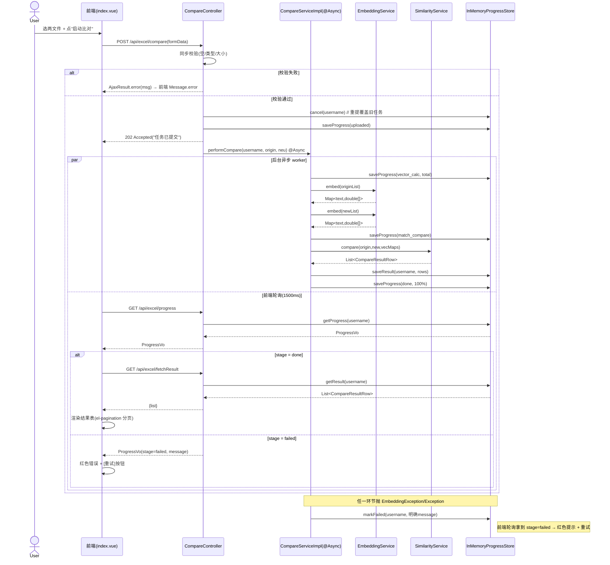
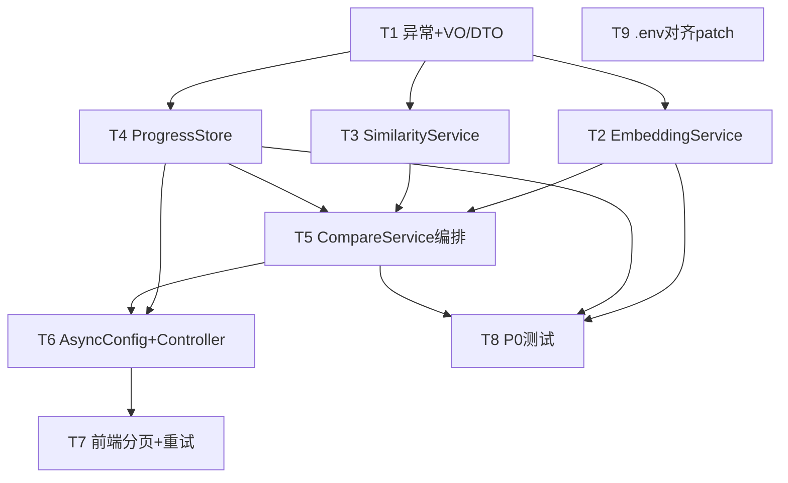

# X-box 比对模块重构 · 增量架构设计 + 任务分解

> 文档类型：增量架构设计（中文，配合 `docs/deliverables/compare_refactor_incremental_prd.md`）
> 作者：架构师 高见远（software-architect）
> 范围：代码质量 P1 / 性能 P1 / 测试 P0 / 配置 D2（外部依赖项暂缓）
> 技术栈（既有，不替换）：后端 Spring Boot 3.2.12 (Java 17) + MyBatis；前端 Vue 2.6 + element-ui 2.x；OkHttp 调宿主 Ollama bge-m3。

---

## 0. 主理人（Qi）决策落地（PRD 第 5 节）

| 待确认 | 决策口径（本轮采用） |
|--------|----------------------|
| Q1 ProgressStore | 仅抽接口 + 内存实现 `InMemoryProgressStore`（保留 5 分钟 TTL 清理）；**Redis 化列为 P2-1，本轮不做**。 |
| Q2 .env 口令对齐 | 方向 **dev ← prod**（prod 凭证绝对不动）。将 `.env.dev` 与 `.env.backend` 的 `SPRING_DATASOURCE_PASSWORD`（及 `PRJ_DB_PWD`）改为与 prod 同值；核查 `ensure_app_user()` 同步问题并给出操作建议（**不擅自重建库/改 prod**）。 |
| Q3 前端结果表 | P1 采用 `el-pagination` 分页（**不引入 vue-virtual-scroller 等新依赖**，最小改动）；虚拟滚动留 P2-2。 |
| Q4 异步失败处理 | worker 任意环节失败 → ProgressStore 记 `failed` + 明确 `message`；前端红色错误提示 + 重试按钮；**全量重试，不返回部分结果**。 |
| Q5 进度/结果键 | 本轮沿用 `username` 单任务键，重提覆盖旧任务；`taskId` 多任务并存留 P2-3。 |
| Q6 异常约定 | `EmbeddingService` 抛 `EmbeddingException`（含 cause 分类枚举 `TIMEOUT / CONNECTION / EMPTY / PARTIAL`），便于前端 message 映射与测试断言。 |

---

## 1. 实现方案 + 框架选型

### 1.1 核心难点与对策

1. **708 行 God Controller + static 状态**：将比对编排下沉为 `ICompareService` 分层；进度/结果从 `static ConcurrentHashMap` 迁移到 Spring 单例 `IProgressStore` bean（接口化，内存实现），彻底消除 static 状态与类加载期泄漏。
2. **O(origin×new) 同步暴力匹配形成可用性 DoS**：引入 `@Async` + 有界 `ThreadPoolTaskExecutor`，比对编排在异步 worker 执行；`/compare` 仅做同步校验后返回 `202 Accepted`，进度经 `IProgressStore` 回写、前端轮询 `GET /progress`。
3. **核心业务零测试（强依赖真实 Ollama）**：将 Ollama 调用抽为 `IOllamaEmbedClient` **接口缝**（可注入单例），`OllamaEmbeddingServiceImpl` 仅依赖该接口；单元测试用 **Mockito mock 接口**即可覆盖「正常 + 4 类异常」，**无需 mockito-inline**（详见 §6）。
4. **十万行结果前端全量渲染卡死**：P1 用 element-ui 自带 `el-pagination` 内存分页（最小改动、零新依赖）。
5. **残留 `[DIAG]` System.out 调试日志**：统一改为 SLF4J `Logger`。

### 1.2 框架 / 库选型（均既有，无新增）

- **异步**：Spring `@EnableAsync` + `ThreadPoolTaskExecutor`（核心 ≤4、队列有界 `64`、拒绝策略打明确告警日志；禁用默认无界 `SimpleAsyncTaskExecutor`）。配置落 `AsyncConfig`（位于 `com.prj.framework.config`，与既有 `RedisConfig` 同目录）。
- **测试**：`spring-boot-starter-test`（JUnit5 + Mockito，已在 pom）+ `spring-security-test`（`@WithMockUser`，迁移既有 `CompareControllerCacheTest` 时需要）。
- **HTTP 客户端**：`OkHttp 4.12.0`（既有），封装进 `OkHttpOllamaEmbedClient` 单例 bean（连接 30s / 读取 120s）。
- **Excel**：Apache POI 5.2.3（既有），读取逻辑抽为 `ExcelReader` 组件。
- **前端分页**：`element-ui` 自带 `el-pagination`（零新增依赖）。
- **配置化沿用**：`@Value("${AI_SERVICE_URL}")` / `@Value("${AI_EMBED_MODEL}")` 不变。

### 1.3 架构模式

经典 **Controller（HTTP 边界 + 校验）→ Service（编排/业务）→ Store（状态）/ Client（外部依赖缝）** 分层；`CompareController` 仅保留 HTTP 映射、文件校验、调度异步、转调 Service（目标行数 ≤200）。

---

## 2. 文件列表及相对路径

> 路径基准：`backend/prj-backend-c/`（后端）、`web/prj-frontend/`（前端）。`【新增】`= 新建；`【修改】`= 改动既有。

### 后端（包路径按 PRD 建议）

| 文件 | 状态 | 说明 |
|------|------|------|
| `src/main/java/com/prj/exception/EmbeddingException.java` | 【新增】 | 向量化业务异常，含 `Category` 枚举 |
| `src/main/java/com/prj/web/vo/ProgressVo.java` | 【新增】 | 进度 VO（stage/percent/current/total/currentText/message） |
| `src/main/java/com/prj/web/vo/CompareResultRow.java` | 【新增】 | 结果行 VO（name/originVal/matchedName/newVal/similarity/diffType） |
| `src/main/java/com/prj/service/embedding/IEmbeddingService.java` | 【新增】 | 向量化服务接口 |
| `src/main/java/com/prj/service/embedding/impl/OllamaEmbeddingServiceImpl.java` | 【新增】 | 分块 + 异常分类实现 |
| `src/main/java/com/prj/service/embedding/IOllamaEmbedClient.java` | 【新增】 | 底层 OkHttp 调用缝（可 mock 接口） |
| `src/main/java/com/prj/service/embedding/impl/OkHttpOllamaEmbedClient.java` | 【新增】 | OkHttp 调 Ollama `/api/embed` 真实实现 |
| `src/main/java/com/prj/service/similarity/ISimilarityService.java` | 【新增】 | 相似度服务接口 |
| `src/main/java/com/prj/service/similarity/impl/SimilarityServiceImpl.java` | 【新增】 | 余弦 + 分类纯函数 |
| `src/main/java/com/prj/service/compare/ICompareService.java` | 【新增】 | 比对编排接口 |
| `src/main/java/com/prj/service/compare/impl/CompareServiceImpl.java` | 【新增】 | 异步编排（`@Async` 入口） |
| `src/main/java/com/prj/service/compare/ExcelReader.java` | 【新增】 | Excel 首列读取组件（抽离 POI） |
| `src/main/java/com/prj/store/IProgressStore.java` | 【新增】 | 进度/结果存储接口 |
| `src/main/java/com/prj/store/impl/InMemoryProgressStore.java` | 【新增】 | 内存实现 + 5 分钟 TTL 清理（bean 内定时） |
| `src/main/java/com/prj/framework/config/AsyncConfig.java` | 【新增】 | `@EnableAsync` + 有界线程池 bean |
| `src/main/java/com/prj/controller/CompareController.java` | 【修改】 | 去 static Map / 去 `[DIAG]` / 调 Service / 返 202 |
| `src/test/java/com/prj/service/embedding/OllamaEmbeddingServiceImplTest.java` | 【新增】 | 正常 + 4 异常（Mockito mock 接口） |
| `src/test/java/com/prj/service/similarity/SimilarityServiceImplTest.java` | 【新增】 | 余弦分类纯函数单测 |
| `src/test/java/com/prj/store/InMemoryProgressStoreTest.java` | 【新增】 | 写入/清理/TTL 单测 |
| `src/test/java/com/prj/service/compare/CompareServiceImplTest.java` | 【新增】 | 编排 + 失败写 failed 单测（mock 全部依赖） |
| `src/test/java/com/prj/store/impl/InMemoryProgressStoreCacheTest.java` | 【新增】 | 由 `CompareControllerCacheTest` 迁移而来（见下） |
| `src/test/java/com/prj/controller/CompareControllerCacheTest.java` | 【修改/迁移】 | 改为校验 `InMemoryProgressStore` 的清理契约，不再反射 static Map |

### 前端

| 文件 | 状态 | 说明 |
|------|------|------|
| `src/views/compare/index.vue` | 【修改】 | `el-table` 加 `el-pagination`；`stage=failed` 红色提示 + 重试按钮；`startCompare` 不再依赖 POST body list；`stageTextMap` 增 `uploaded`/`failed` |
| `src/api/compare.js` | 【不变/小改】 | 端点路径保持不变（`/api/excel/compare`、`/progress`、`/fetchResult`、`/downloadResult`）；`compareExcelApi` 超时维持 300000，兼容 202 |

### 配置 / 运维

| 文件 | 状态 | 说明 |
|------|------|------|
| `.env.dev` | 【修改】 | `PRJ_DB_PWD` / `SPRING_DATASOURCE_PASSWORD` → 与 prod 同值 |
| `.env.backend` | 【修改】 | `SPRING_DATASOURCE_PASSWORD` → 与 prod 同值 |
| `db/mysql_scripts/docker-entrypoint-wrapper.sh` | 【修改】 | `ensure_app_user()` 增加 `ALTER USER ... IDENTIFIED BY`，使口令随 `.env` 同步（见 §7 / T9） |

---

## 3. 数据结构与接口（类图 + 接口签名）

### 3.1 类图（Mermaid）

```mermaid
classDiagram
    class CompareController {
        +compareExcel(MultipartFile, MultipartFile) ResponseEntity
        +getProgress() AjaxResult
        +fetchResult() AjaxResult
        +downloadResult(HttpServletResponse) void
    }
    class ICompareService {
        <<interface>>
        +performCompare(String, MultipartFile, MultipartFile) void
    }
    class CompareServiceImpl {
        -IEmbeddingService embeddingService
        -ISimilarityService similarityService
        -IProgressStore progressStore
        -ExcelReader excelReader
        +performCompare(String, MultipartFile, MultipartFile) void @Async
    }
    class IEmbeddingService {
        <<interface>>
        +embed(List~String~) Map~String,double[]~
    }
    class OllamaEmbeddingServiceImpl {
        -IOllamaEmbedClient client
        -int EMBED_BATCH_SIZE = 100
        +embed(List~String~) Map~String,double[]~
    }
    class IOllamaEmbedClient {
        <<interface>>
        +embedBatch(List~String~) List~double[]~
    }
    class OkHttpOllamaEmbedClient {
        -OkHttpClient httpClient
        -String embedUrl
        -String model
        +embedBatch(List~String~) List~double[]~
    }
    class ISimilarityService {
        <<interface>>
        +compare(List~String~, List~String~, Map, Map) List~CompareResultRow~
    }
    class SimilarityServiceImpl {
        -double SIMILARITY_THRESHOLD = 0.85
        -double NEW_COVERAGE_THRESHOLD = 0.5
        +cosine(double[], double[]) double
        +compare(...) List~CompareResultRow~
    }
    class IProgressStore {
        <<interface>>
        +saveProgress(String, ProgressVo) void
        +saveResult(String, List~CompareResultRow~) void
        +getProgress(String) ProgressVo
        +getResult(String) List~CompareResultRow~
        +markFailed(String, String) void
        +cancel(String) void
    }
    class InMemoryProgressStore {
        -Map~String,ProgressVo~ progressMap
        -Map~String,List~CompareResultRow~~ resultMap
        -Map~String,Long~ expireAt
        +saveProgress(...) void
        +saveResult(...) void
        +getProgress(...) ProgressVo
        +getResult(...) List~CompareResultRow~
        +markFailed(...) void
        +cancel(...) void
    }
    class ExcelReader {
        -int MAX_EXCEL_ROWS = 50000
        +readFirstColumnNames(MultipartFile) List~String~
    }
    class EmbeddingException {
        <<enum>> Category { TIMEOUT, CONNECTION, EMPTY, PARTIAL }
        +Category category
        +EmbeddingException(Category, String, Throwable)
        +getCategory() Category
    }
    class ProgressVo {
        +String stage
        +int percent
        +int current
        +int total
        +String currentText
        +String message
    }
    class CompareResultRow {
        +String name
        +String originVal
        +String matchedName
        +String newVal
        +double similarity
        +String diffType
    }
    class AsyncConfig {
        +compareTaskExecutor() ThreadPoolTaskExecutor
    }

    CompareController --> ICompareService : 编排
    CompareController --> IProgressStore : 读进度/结果
    CompareServiceImpl ..|> ICompareService
    CompareServiceImpl --> IEmbeddingService
    CompareServiceImpl --> ISimilarityService
    CompareServiceImpl --> IProgressStore
    CompareServiceImpl --> ExcelReader : 读Excel
    CompareServiceImpl ..> ProgressVo : 写
    CompareServiceImpl ..> CompareResultRow : 写
    OllamaEmbeddingServiceImpl ..|> IEmbeddingService
    OllamaEmbeddingServiceImpl --> IOllamaEmbedClient : 调底层缝
    OkHttpOllamaEmbedClient ..|> IOllamaEmbedClient
    OllamaEmbeddingServiceImpl ..> EmbeddingException : throws
    SimilarityServiceImpl ..|> ISimilarityService
    InMemoryProgressStore ..|> IProgressStore
    InMemoryProgressStore ..> ProgressVo
    InMemoryProgressStore ..> CompareResultRow
    AsyncConfig ..> CompareServiceImpl : @Async("compareTaskExecutor")
```

### 3.2 关键接口签名

**`EmbeddingException`（com.prj.exception）**
```java
public class EmbeddingException extends RuntimeException {
    public enum Category { TIMEOUT, CONNECTION, EMPTY, PARTIAL }
    private final Category category;
    public EmbeddingException(Category category, String message, Throwable cause) { super(message, cause); this.category = category; }
    public EmbeddingException(Category category, String message) { super(message); this.category = category; }
    public Category getCategory() { return category; }
}
```

**`IOllamaEmbedClient`（底层缝，便于 mock）**
```java
public interface IOllamaEmbedClient {
    /**
     * 调 Ollama /api/embed 对单批次(≤EMBED_BATCH_SIZE)文本向量化。
     * @return 与 texts 顺序一致的向量；长度必须等于 texts.size()
     * @throws EmbeddingException TIMEOUT(超时)/CONNECTION(连接失败)/EMPTY(200但空)
     */
    List<double[]> embedBatch(List<String> texts);
}
```

**`IEmbeddingService`（com.prj.service.embedding）**
```java
public interface IEmbeddingService {
    /** 整段文本向量化，按 EMBED_BATCH_SIZE=100 自动分块；任一失败抛 EmbeddingException(分类)。 */
    Map<String, double[]> embed(List<String> texts) throws EmbeddingException;
}
```
*`OllamaEmbeddingServiceImpl`：循环分块 → `client.embedBatch(batch)`；对返回做数量/空向量校验（不符则计入 failCount）；捕获 `EmbeddingException` 累计 failCount + 记录分类。循环结束若 `failCount>0`：有成功批次则抛 `PARTIAL`，否则原样抛出所记录分类的异常（保留 cause）。*

**`ISimilarityService`（com.prj.service.similarity）**
```java
public interface ISimilarityService {
    List<CompareResultRow> compare(List<String> originTexts, List<String> newTexts,
                                   Map<String, double[]> originVecMap, Map<String, double[]> newVecMap);
}
```
*纯函数：`cosine(a,b)` + 分类（完全匹配/语义模糊匹配/未匹配/新增项）。冻结 `SIMILARITY_THRESHOLD=0.85`、`NEW_COVERAGE_THRESHOLD=0.5`。*

**`IProgressStore`（com.prj.store）**
```java
public interface IProgressStore {
    void saveProgress(String username, ProgressVo progress);   // 覆盖写
    void saveResult(String username, List<CompareResultRow> result); // 覆盖写
    ProgressVo getProgress(String username);                    // 无则 null
    List<CompareResultRow> getResult(String username);          // 无则 null
    void markFailed(String username, String message);           // stage=failed + message
    void cancel(String username);                               // 删除 progress+result（重提覆盖）
}
```
*`InMemoryProgressStore`：两个 `ConcurrentHashMap` + `Map<String,Long> expireAt`；`@PostConstruct` 起单守护线程 `ScheduledExecutorService` 每 60s 扫描过期（5 分钟 TTL）并清除；`saveXxx` 时刷新 `expireAt=now+5min`。*

**`ICompareService`（com.prj.service.compare）**
```java
public interface ICompareService {
    /** 异步比对入口（impl 上 @Async("compareTaskExecutor")）。 */
    void performCompare(String username, MultipartFile origin, MultipartFile neu);
}
```
*`CompareServiceImpl.performCompare` 编排：saveProgress(uploaded) → ExcelReader.read → saveProgress(vector_calc) → embeddingService.embed(origin) → embeddingService.embed(new)（new 侧覆盖率 < 阈值则 markFailed 并 return）→ saveProgress(match_compare) → similarityService.compare → saveResult → saveProgress(done,100%)。全程 try/catch：抛 `EmbeddingException` 或任意 `Exception` → `progressStore.markFailed(username, 明确message)`。*

**VO**
```java
// com.prj.web.vo.ProgressVo
public class ProgressVo {
    private String stage;       // uploaded/vector_calc/match_compare/done/failed
    private int percent;        // 0~100
    private int current;        // 已处理条数（前端字段 done）
    private int total;
    private String currentText; // 前端字段 currentText
    private String message;     // stage=failed 时的错误原因
    // getters/setters
}
// com.prj.web.vo.CompareResultRow
public class CompareResultRow {
    private String name; private String originVal; private String matchedName;
    private String newVal; private double similarity; private String diffType;
    // getters/setters（字段名必须与既有前端 el-table 列 prop 完全一致）
}
```

---

## 4. 程序调用流程（Mermaid 时序图）



---

## 5. 任务列表（有序、含依赖、按实现顺序）

> 说明：下列 T1–T9 依主理人显式要求拆 9 个任务（覆盖默认 ≤5 引导值）。每个任务标注依赖与优先级（P0 阻断上线 / P1 本轮交付 / D2 配置）。

| 任务 | 名称 | 源文件（见 §2） | 依赖 | 优先级 |
|------|------|----------------|------|--------|
| **T1** | 抽异常 + VO/DTO | `EmbeddingException`、`ProgressVo`、`CompareResultRow` | 无 | P1 |
| **T2** | EmbeddingService 接口 + impl + client 缝 | `IEmbeddingService`、`OllamaEmbeddingServiceImpl`、`IOllamaEmbedClient`、`OkHttpOllamaEmbedClient` | T1 | P0 |
| **T3** | SimilarityService 纯函数 | `ISimilarityService`、`SimilarityServiceImpl` | T1 | P1 |
| **T4** | ProgressStore 接口 + 内存实现 | `IProgressStore`、`InMemoryProgressStore` | T1 | P1 |
| **T5** | CompareService 编排（含 ExcelReader） | `ICompareService`、`CompareServiceImpl`、`ExcelReader` | T2, T3, T4 | P1 |
| **T6** | AsyncConfig + CompareController 改造 | `AsyncConfig`、`CompareController`(改) | T4, T5 | P0 |
| **T7** | 前端分页 + 重试按钮 + 轮询调整 | `index.vue`(改)、`compare.js`(小改) | T4, T6 | P1 |
| **T8** | P0 测试（Mockito 覆盖 正常 + 4 异常 ≥5 用例，迁移 CacheTest） | 4 个新增测试类 + `CompareControllerCacheTest`(改) | T2, T4, T5 | P0 |
| **T9** | .env 核查对齐 patch + ensure_app_user 同步增强 | `.env.dev`、` .env.backend`、`docker-entrypoint-wrapper.sh` | 无（可与 T1–T8 并行） | D2 |

**依赖关系图（Mermaid）**



**各任务要点**
- **T1**：建立 `EmbeddingException`（含 `Category` 枚举）与两个 VO；字段名严格对齐既有前端（`originVal/newVal/diffType/matchedName/similarity/name`），`ProgressVo` 保留 `current/total/currentText/stage` 以兼容轮询。
- **T2**：`IOllamaEmbedClient` 为**可注入接口缝**；`OllamaEmbeddingServiceImpl` 仅依赖该接口（便于 mock）；分块 `EMBED_BATCH_SIZE=100`，connect 30s / read 120s；异常分类见 §3.2。
- **T3**：`cosine` + 四分类；冻结 `SIMILARITY_THRESHOLD=0.85`、`NEW_COVERAGE_THRESHOLD=0.5`；new 侧覆盖率校验留给 T5 编排（见 §3.2）。
- **T4**：`InMemoryProgressStore` 内存双 Map + 5 分钟 TTL（bean 内 `ScheduledExecutorService` 守护线程扫描），`cancel` 供重提覆盖。
- **T5**：`CompareServiceImpl.performCompare` 标 `@Async("compareTaskExecutor")`；抽 `ExcelReader` 剥离 POI；编排失败时 `markFailed`；username 单键覆盖。
- **T6**：新增 `AsyncConfig`（`@EnableAsync` + 有界 `ThreadPoolTaskExecutor` 核心≤4/队列64/拒绝告警）；`CompareController` 去 static Map、`[DIAG]` 日志；校验通过返 `202 Accepted`，失败同步 `AjaxResult.error`。
- **T7**：`el-table` 绑 `pagedResult` + `el-pagination`；`stageTextMap` 增 `uploaded`/`failed`；`stage=failed` 显示红色错误 + `[重试]`（重新 `startCompare`）；`startCompare` 不再消费 POST body list。
- **T8**：`OllamaEmbeddingServiceImplTest` 用 Mockito mock `IOllamaEmbedClient`，覆盖 ①正常 ②TIMEOUT ③CONNECTION ④EMPTY ⑤PARTIAL（≥5 用例）；迁移 `CompareControllerCacheTest` 为校验 `InMemoryProgressStore` 清理契约。
- **T9**：见 §7 与下方「.env 对齐 patch」。

---

## 6. 依赖包列表

| 包 / 依赖 | 用途 | 是否新增 |
|-----------|------|----------|
| `spring-boot-starter-test`（JUnit5 + Mockito） | 单元测试 | 既有（pom 已含） |
| `spring-security-test`（`@WithMockUser`） | 迁移 CacheTest 安全上下文 | 既有（pom 已含） |
| `mockito-inline` | **不需要**（因抽 `IOllamaEmbedClient` 接口缝，mock 接口即可，无需 mock 构造器/静态） | 不引入；若未来直接测 `OkHttpOllamaEmbedClient`（mock `OkHttpClient` 构造链）才考虑 |
| 前端 `vue-virtual-scroller` 等 | **不引入**（Q3 决策走 `el-pagination`） | 不引入 |
| 其余（OkHttp/POI/fastjson2/Redis） | 既有 | 不引入 |

**结论**：本轮**零新增第三方依赖**；Mockito 足以覆盖全部 4 类异常场景（接口缝 mock）。

---

## 7. 共享知识（跨文件约定）

### 7.1 常量（全仓统一，禁止散落硬编码）
| 常量 | 值 | 落点 |
|------|----|------|
| `EMBED_BATCH_SIZE` | 100 | `OllamaEmbeddingServiceImpl` |
| `SIMILARITY_THRESHOLD` | 0.85 | `SimilarityServiceImpl` |
| `NEW_COVERAGE_THRESHOLD` | 0.5 | `CompareServiceImpl`（new 侧覆盖率校验） |
| `MAX_EXCEL_ROWS` | 50000 | `ExcelReader` |
| OkHttp connect/read | 30s / 120s | `OkHttpOllamaEmbedClient` |
| 进度 TTL | 5 分钟 | `InMemoryProgressStore` |
| 异步线程池 | 核心=最大=4，队列=64，拒绝打告警 | `AsyncConfig` |

### 7.2 进度 stage 枚举（前后端共用）
`uploaded` → `vector_calc` → `match_compare` → `done` / `failed`
- 前端 `stageTextMap` 需补：`uploaded:"文件已上传"`, `failed:"比对失败"`。
- `failed` 必带 `message`（明确原因），前端据此红色提示 + 重试。

### 7.3 202 响应约定
- `POST /api/excel/compare` 成功 → `ResponseEntity.status(202).body(AjaxResult.success("任务已提交"))`；响应体 `code=200`，前端 `request.js` 拦截器按 `res.data.code` 判定成功，不受影响。
- 同步校验失败 → `AjaxResult.error(msg)`（body code=500）→ 前端 `Message.error` 展示。

### 7.4 异常分类 → 前端 message 映射
`EmbeddingException.Category`：`TIMEOUT`→"Ollama 超时，请检查向量服务"；`CONNECTION`→"Ollama 连接失败，请检查向量服务"；`EMPTY`→"向量服务返回空结果"；`PARTIAL`→"部分文本向量化失败，请重试"。统一经 `markFailed` 写入 `ProgressVo.message`。

### 7.5 进度/结果键约定
- 本轮 **username 单任务键**；`cancel(username)` 在每次提交时先清旧进度/结果，实现重提覆盖（Q5）。

### 7.6 前端轮询端点（与既有 `api/compare.js` 对齐，不变）
- `POST /api/excel/compare`、`GET /api/excel/progress`、`GET /api/excel/fetchResult`、`GET /api/excel/downloadResult`。
- 轮询间隔 1500ms（既有）；`done → fetchResult` 取数，不再依赖 POST body。

### 7.7 字段名约定（VO ↔ 前端列 ↔ 下载）
`name / originVal / matchedName / newVal / similarity / diffType` 固定不变（保证 `el-table` 列 prop 与 `downloadResult` 导出兼容）。

---

## 8. 待明确事项 / 风险

1. **ensure_app_user 口令同步（已分析，关键风险，见 T9）**：`ensure_app_user()` 当前用 `CREATE USER IF NOT EXISTS ... IDENTIFIED BY '${app_pwd}'`，**对既存用户不会更新口令**。`.env.dev` 改口令后，`prj_user` 仍保留旧口令 → 后端（新口令）连不上库。已在 T9 patch 中建议**增加 `ALTER USER 'prj_user'@'%' IDENTIFIED BY '${app_pwd}'`**（幂等、安全、非重建库/非改 prod），并在重启 MySQL 容器后自动同步；若仅改 `.env` 不重启，需人工执行一次 `ALTER USER`。**工程师应用前须复核脚本与口令。**
2. **OkHttp client 是否抽为可注入单例**：已决策——抽 `IOllamaEmbedClient` 接口 + `OkHttpOllamaEmbedClient` 单例 bean（`OkHttpClient` 由 `@Bean` 提供，连接池 20 连接复用）。
3. **Excel 解析是否抽独立 Reader**：已决策——抽 `ExcelReader` 组件（`com.prj.service.compare`），Controller 不再含 POI 逻辑（保留 `[DIAG]` 去除后的 `Logger` 与 `downloadResult` 的 POI 导出）。
4. **测试对 OkHttp 的 mock 粒度**：已决策——仅 mock `IOllamaEmbedClient` 接口（不需 mockito-inline）；`OkHttpOllamaEmbedClient` 真实 HTTP 不进单测，留后续集成测试。
5. **202 前端兼容**：`request.js` 拦截器按 `res.data.code` 判定，202 + body code=200 走成功分支，已验证兼容；校验失败（code=500）需前端在 `compareExcelApi().catch` 中 `Message.error`，T7 落实。
6. **结果表分页粒度**：T7 采用前端内存 `slice` 分页（十万行全量来自 `fetchResult`）。若未来超大数据集，后端分页列为 P2。
7. **downloadResult 实现位置**：仍走后端按 username 从 `IProgressStore.getResult` 取 `CompareResultRow` 生成 Excel（逻辑不变，仅读取源由 static Map 改为 bean）。
8. **taskId 化**：本轮不做（Q5），`username` 单键；`taskId` 多任务并存留 P2-3。
9. **`.env.prod` 实测值**：落盘 `.env.prod` 读得 `PRJ_DB_PWD`/`SPRING_DATASOURCE_PASSWORD = <REDACTED-live-prod>`（与 PRD 描述一致）。若该文件实为 `.example` 模板副本，工程师须以**真实** `.env.prod` 为准二次确认后再套用到 `.env.dev`/`.env.backend`。

---

## 9. 附录：T9「.env 对齐 patch + 核查说明」（dev ← prod，prod 不动）

### 9.1 口令现状核对（已 Read 确认）
- `.env.dev`：`PRJ_DB_PWD=Prj@Dev789`、`SPRING_DATASOURCE_PASSWORD=Prj@Dev789`
- `.env.backend`：`SPRING_DATASOURCE_PASSWORD=Prj@Dev789`
- `.env.prod`：`PRJ_DB_PWD=<REDACTED-live-prod>`、`SPRING_DATASOURCE_PASSWORD=<REDACTED-live-prod>`

### 9.2 目标（dev ← prod）
将 `.env.dev` 与 `.env.backend` 的 `SPRING_DATASOURCE_PASSWORD`（及 `.env.dev` 的 `PRJ_DB_PWD`）改为 `<REDACTED-live-prod>`。

### 9.3 patch 内容
**`.env.dev`**
```diff
-PRJ_DB_PWD=Prj@Dev789
+PRJ_DB_PWD=<REDACTED-live-prod>
-SPRING_DATASOURCE_PASSWORD=Prj@Dev789
+SPRING_DATASOURCE_PASSWORD=<REDACTED-live-prod>
```
**`.env.backend`**
```diff
-SPRING_DATASOURCE_PASSWORD=Prj@Dev789
+SPRING_DATASOURCE_PASSWORD=<REDACTED-live-prod>
```

### 9.4 核查结论 + 操作建议（ensure_app_user 同步问题）
- **结论**：`ensure_app_user()` 用 `CREATE USER IF NOT EXISTS`，对**已存在**的 `prj_user` **不会**变更口令。仅改 `.env.dev` 而不增强脚本，重启 MySQL 后 `prj_user` 仍用旧口令，后端（新口令）将 `Access denied`。
- **建议 A（推荐，代码 patch，幂等安全）**：在 `ensure_app_user()` 的 `CREATE USER ...` 之后追加一行 `ALTER USER`（用户已由上一行保证存在，故 `ALTER USER` 永不报“用户不存在”）：
  ```sql
  CREATE USER IF NOT EXISTS '${app_user}'@'%' IDENTIFIED BY '${app_pwd}';
  ALTER USER '${app_user}'@'%' IDENTIFIED BY '${app_pwd}';
  GRANT ALL PRIVILEGES ON ${app_db}.* TO '${app_user}'@'%';
  FLUSH PRIVILEGES;
  ```
  此改动在每次 MySQL 容器启动时把口令同步为 `.env` 新值，**不重建库、不改 prod**，属 dev/共享用户自愈增强。
- **建议 B（若本次不重启 MySQL 容器）**：改完 `.env` 后，人工连 MySQL 执行一次 `ALTER USER 'prj_user'@'%' IDENTIFIED BY '<REDACTED-live-prod>'; FLUSH PRIVILEGES;` 立即生效。
- **禁止**：擅自 `DROP USER` / 重建库 / 修改 `.env.prod` 凭证。

### 9.5 验证步骤（工程师执行）
1. 套用 9.3 patch 到 `.env.dev`、`.env.backend`；应用 9.4 建议 A 到 `docker-entrypoint-wrapper.sh`。
2. **二次确认真实 `.env.prod`** 口令值（见 §8.9），与套用值完全一致。
3. 重启 dev-mysql 容器 → 观察日志 `应用账号授权完成`；后端容器起启后验证能连库（无 `Access denied`）。
4. 不重启场景：执行建议 B 后手动验证连接。
5. 回归：比对模块冒烟（`/compare` 提交 → 轮询 → 结果），确认口令变更未影响业务库读写。
```
