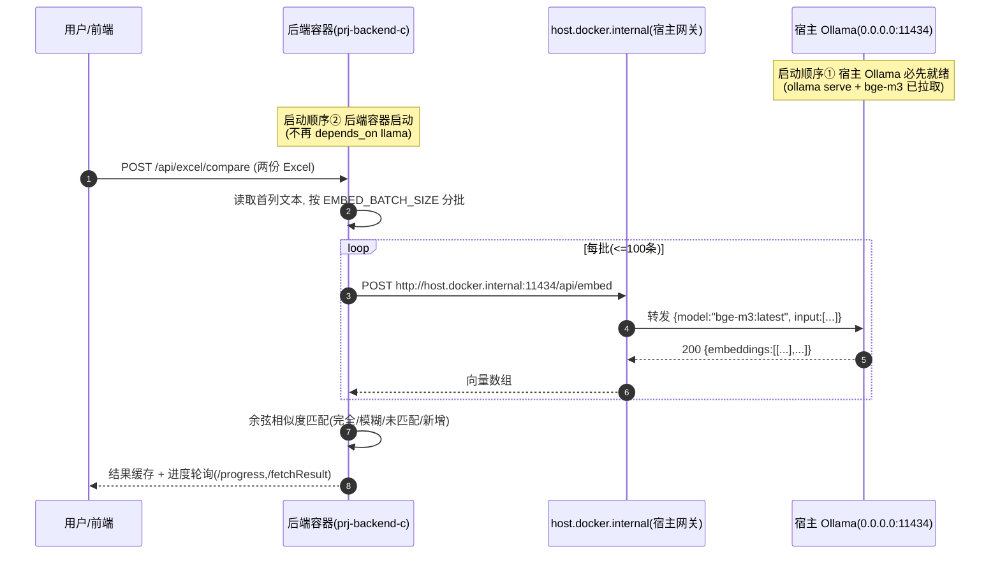

# Ollama 宿主原生部署迁移设计（X-box）

> 设计人：高见远（架构师）　|　日期：2026-07-16
> 目标机：Mac Mini M2 / macOS Sonoma 14.8.7 / OrbStack 2.1.3（生产）；用户开发机：Win11 + WSL2 + Docker Desktop（dev）
> 范围：把 `Ollama + bge-m3` 从「容器内部署（`dev-prj-llama`）」改为「宿主机原生部署」，后端容器经 `host.docker.internal:11434` 访问。

---

## 0. ⚠️ 两个关键纠正（与原任务假设的偏差）

| # | 原假设（任务书） | 代码实证结论（已 Read 复核） | 设计落地 |
|---|------------------|------------------------------|----------|
| 1 | 后端用 `SPRING_AI_OLLAMA_BASE_URL` 指向 Ollama | 后端 **未使用 Spring AI**，而是 `CompareController` 用 **OkHttp 直连 Ollama REST**；地址来自 `@Value("${AI_SERVICE_URL:http://dev-prj-llama:11434}")`（见 `CompareController.java:175`）。`grep` 全仓无 `SPRING_AI_OLLAMA` / `OLLAMA_HOST` 在后端代码中的引用。 | **真实变量是 `AI_SERVICE_URL`**（基础地址，拼接 `/api/embed`）。改值即改此变量，无需引入 spring-ai-ollama。 |
| 2 | `AI_API_TOKEN`（.env.prod 有）可能用于 Ollama 鉴权 | 全仓 `grep AI_API_TOKEN` 仅命中 env 文件 + docs + `scan_secrets_tmp.py`，**后端 Java 代码从不发送该令牌**（OkHttp 请求无 `Authorization` 头，Ollama 默认无鉴权）。 | `AI_API_TOKEN` 当前是**预留/纵深防御占位**，未被消费。是否真正实现鉴权需裁决（见 §8 待明确事项 #1）。 |

> 结论先行：**本次迁移本质是「改一处 env 值（dev-prj-llama → host.docker.internal）+ 删容器 Ollama 服务块 + 补宿主初始化脚本」，后端源码无需改动。**

---

## 1. 实现方案 + 框架选型

### 1.1 访问拓扑（容器 ↔ 宿主网络路径）

```
┌─────────────────────────────────────────────────────────────┐
│  宿主机（Mac Mini / Win11）                                  │
│                                                              │
│   ┌──────────────┐         host.docker.internal:11434       │
│   │ 宿主 Ollama   │◄──────────────────────────────────┐      │
│   │ 0.0.0.0:11434 │   (Docker Desktop/OrbStack 内置解析) │      │
│   │ model bge-m3  │                                      │      │
│   └──────────────┘                                      │      │
│                                                          │      │
│   Docker 运行时（OrbStack / Docker Desktop）              │      │
│   ┌────────────────────────────┐    ┌──────────────────┴─────┐│
│   │ 后端容器 prj-backend-c      │    │ 其它容器(mysql/redis/   ││
│   │ AI_SERVICE_URL=            │    │  nginx/php)             ││
│   │  http://host.docker.       │    │  (dev-network/          ││
│   │  internal:11434            │    │   prj-network)          ││
│   │ 调用 /api/embed            │    │                         ││
│   └────────────────────────────┘    └─────────────────────────┘│
└─────────────────────────────────────────────────────────────┘
```

- **核心网桥**：`host.docker.internal` 在 **Docker Desktop（Mac/Win）** 与 **OrbStack 2.1.3** 中默认可达宿主机，无需额外 `extra_hosts`。这是 `Mac-mini-deployment-guide.md §6` 已记载的方案，本次将其工程化、落盘到编排文件。
- **为什么必须 `OLLAMA_HOST=0.0.0.0:11434`**：容器内后端经宿主机**网关 IP**（非 `127.0.0.1`）访问 `host.docker.internal`，因此宿主 Ollama 必须监听 `0.0.0.0`（而非仅 `localhost`），否则容器侧连接被拒。
- **安全权衡（重要）**：原容器把 `11434` 仅绑 `127.0.0.1`（防未授权）；宿主原生后 `0.0.0.0:11434` 会暴露到宿主机所有网卡（含 LAN）。Ollama 默认无鉴权 → 需依赖宿主防火墙 / 网络隔离，或反向代理强制 `AI_API_TOKEN`（见 §8 #1）。

### 1.2 dev 与 prod 的差异点

| 维度 | dev（优先改造） | prod（耦合修复） |
|------|----------------|------------------|
| 编排组合 | `base.yml` + `business-prj.dev.yml`（dev 主栈） | `base.yml` + `prod.yml` |
| 后端 env 来源 | `.env.backend`（env_file）+ compose `environment` 覆盖 | `.env.prod`（env_file） |
| `AI_SERVICE_URL` 新值 | `http://host.docker.internal:11434` | `http://host.docker.internal:11434`（**同值**） |
| `depends_on` 改动 | 删 `dev-prj-llama` 条目 | 删 `depends_on.dev-prj-llama` 条目 |
| 启动等待 | 原 `service_healthy`（容器 Ollama）；改为**无 Ollama 依赖**，由宿主侧保障 Ollama 先就绪 | 原 `service_started`；改为删条目，仍 `service_started` 等待 mysql/redis |
| 容器 Ollama | 从 `base.yml` 删除（仅留注释版回退块） | 同左（prod 本就不自带 llama，复用 base 的——删后即无） |

> 说明：`application-prod.yml` 与 `application.yml` **均未设置** `AI_SERVICE_URL`，该值完全由 compose `environment` 注入；故只改 compose 即可，无需动 Spring 配置。

### 1.3 框架 / 库选型

- **不引入** spring-ai / spring-ai-ollama starter：后端以 OkHttp 直连 Ollama `/api/embed`（已在 `CompareController.java:515` `callBatchEmbedApi`），`pom.xml` 已有 `okhttp` 依赖（L49/L248 注释提及）。新增依赖 = **0**。
- **宿主侧**：macOS 用 `brew install ollama`；Windows 用官方 installer / `winget install Ollama.Ollama`。模型 `bge-m3` 由 `ollama pull` 拉取，权重持久化于宿主（`~/Library/Application Support/Ollama` 或 `%USERPROFILE%\.ollama`）。

---

## 2. 文件列表及相对路径（本次创建 / 修改）

### 2.1 新增文件
| 路径 | 作用 |
|------|------|
| `scripts/setup-host-ollama.sh` | Mac 宿主初始化：装 Ollama、设 `OLLAMA_HOST=0.0.0.0:11434`、拉 `bge-m3`、健康校验 |
| `scripts/setup-host-ollama.ps1` | Win/WSL2 宿主初始化（等效 PowerShell 版） |
| `docs/host-ollama-setup.md` | 宿主部署运行说明（含启动顺序、排错、防火墙建议） |

### 2.2 修改文件
| 路径 | 改动类型 | 关键改动 |
|------|----------|----------|
| `docker-compose.base.yml` | **删 + 注释** | 删除 `dev-prj-llama` 服务块（L79–116）；末尾追加「注释版回退块」供紧急恢复 |
| `docker-compose.business-prj.dev.yml` | **改** | `AI_SERVICE_URL` → `host.docker.internal`（L69）；删 `depends_on.dev-prj-llama`（L77–78） |
| `docker-compose.prod.yml` | **改** | `AI_SERVICE_URL` → `host.docker.internal`（L116）；删 `depends_on.dev-prj-llama`（L122–123） |
| `docker-compose.business-prj.yml` | **改 + 删** | `AI_SERVICE_URL` → `host.docker.internal`（L59）；删 `depends_on.dev-prj-llama`（L63）；删重复 `dev-prj-llama` 块（L67–92，R-05 遗留） |
| `.env.backend` | **改** | `AI_SERVICE_URL=http://host.docker.internal:11434`（L28，与 compose 保持一致） |
| `.env.dev` | **注释** | 在 `AI_API_TOKEN`（L19）上方补注「当前未被后端消费，预留鉴权」 |
| `docs/prod-mac-runbook.md` | **改** | §6 Ollama 段：由「容器内 CPU 提醒」改为「宿主原生 Ollama + 启动顺序 + host.docker.internal」 |
| `docs/Mac-mini-deployment-guide.md` | **改（轻微）** | §6 已正确，补充「编排层已改为 host.docker.internal，无需手动改 env」 |
| `docs/architecture_current_topology.mmd` | **改** | `LL` 节点改为「宿主原生 Ollama（host.docker.internal）」 |
| `docs/architecture_target_topology.mmd` | **改** | `LLp` 节点说明同步为宿主原生（可选） |

### 2.3 验证性（不改代码，仅确认/注释）
| 路径 | 改动类型 | 说明 |
|------|----------|------|
| `backend/prj-backend-c/src/main/java/com/prj/controller/CompareController.java` | **注释** | 确认 `AI_SERVICE_URL` 已外部化；补注释说明宿主部署取值 |
| `backend/prj-backend-c/src/main/resources/application.yml` | **注释** | 显式注释 `AI_SERVICE_URL` / `AI_EMBED_MODEL` 契约（不硬编码） |
| `backend/prj-backend-c/pom.xml` | **无改动** | 记录：无需 spring-ai-ollama，OkHttp 直连 |

---

## 3. 数据结构和接口（env 契约）

> 本次「接口」即**环境变量契约**。后端仅消费 `AI_SERVICE_URL`（+ `AI_EMBED_MODEL`），不消费 `AI_API_TOKEN`。

### 3.1 Env 变量契约表

| 变量 | 归属层 | 值（迁移后） | 是否必须 | 说明 / 来源 |
|------|--------|--------------|----------|-------------|
| `OLLAMA_HOST` | **宿主侧** | `0.0.0.0:11434` | 必须 | 宿主 Ollama 监听地址；设成 `0.0.0.0` 容器才能经网关 IP 连上 |
| `OLLAMA_MODEL` / 模型 | **宿主侧** | `bge-m3:latest` | 必须 | `ollama pull bge-m3` 拉取；须与后端 `AI_EMBED_MODEL` 一致 |
| `AI_SERVICE_URL` | **后端容器侧** | `http://host.docker.internal:11434` | 必须 | 后端经此调 `/api/embed`；**dev 与 prod 同值**；若后端未来也上宿主则改 `http://localhost:11434` |
| `AI_EMBED_MODEL` | 后端容器侧 | `bge-m3:latest` | 可选（有默认值） | `@Value("${AI_EMBED_MODEL:bge-m3:latest}")`；与宿主模型名一致 |
| `AI_API_TOKEN` | env 文件 | 保留原值 | **当前非必须** | 见 §8 #1：文档标注「后端调用 Ollama 时携带」，但代码未消费；保留为占位/未来鉴权 |

### 3.2 契约关系（classDiagram 等价表示）

```mermaid
classDiagram
    class HostMachine {
        +OLLAMA_HOST: 0.0.0.0:11434
        +OLLAMA_MODEL: bge-m3:latest
        +serve() 启动 ollama serve
        +pullModel() ollama pull bge-m3
    }
    class BackendContainer {
        +AI_SERVICE_URL: http://host.docker.internal:11434
        +AI_EMBED_MODEL: bge-m3:latest
        +AI_API_TOKEN: (预留,未消费)
        +callEmbed(texts) POST /api/embed
    }
    class OllamaProcess {
        +endpoint /api/embed
        +model bge-m3:latest
        +auth none(默认)
    }
    HostMachine "1" *-- "1" OllamaProcess : 原生运行
    BackendContainer ..> HostMachine : host.docker.internal:11434
    BackendContainer ..> OllamaProcess : /api/embed(model,input)
    note for BackendContainer "compareExcel→batchEmbedding→callBatchEmbedApi"
    note for OllamaProcess "无鉴权; 暴露 0.0.0.0 需防火墙"
```

---

## 4. 程序调用流程（时序图 / 文字）

### 4.1 调用链路（后端容器 → 宿主 Ollama）



### 4.2 启动顺序约定（强约束）

1. **宿主 Ollama 先于任何 docker compose 启动**：
   - Mac：`brew services start ollama` 或 `ollama serve &`；`ollama pull bge-m3`（首次）。
   - Win：`ollama app` 启动 / `ollama serve`；`ollama pull bge-m3`。
   - 校验：`curl -sf http://localhost:11434/api/tags | grep bge-m3`。
2. **再起基础设施与后端**：`docker compose -f ... -f ... up -d`。后端 `depends_on` 仅保留 mysql/redis，**不再等待 Ollama**，因 Ollama 在宿主、不在 compose 编排内。
3. **失败模式**：若宿主 Ollama 未起，首个 `/api/embed` 调用报 `Ollama 异常，状态码：...`/`连接拒绝`，由 `CompareController.callBatchEmbedApi` 抛出明确异常（非静默退化）。需在排错文档写明此现象。

---

## 5. 任务列表（有序、含依赖、按实现顺序）

> 规则遵循：最多 5 个任务；dev 在前、prod 耦合在后；每条标注文件与改动类型（增/改/删）。

| Task | 名称 | 涉及文件（改动类型） | 依赖 | 优先级 |
|------|------|----------------------|------|--------|
| **T01** | 宿主侧 Ollama 初始化（新增脚本+文档） | `scripts/setup-host-ollama.sh`(增)、`scripts/setup-host-ollama.ps1`(增)、`docs/host-ollama-setup.md`(增) | — | P0 |
| **T02** | Dev 编排与 env 指向宿主 Ollama | `docker-compose.base.yml`(删+注释)、`docker-compose.business-prj.dev.yml`(改)、`.env.backend`(改)、`.env.dev`(注释) | T01 | P0 |
| **T03** | Prod 耦合修复 + 遗留编排清理 + runbook | `docker-compose.prod.yml`(改)、`docker-compose.business-prj.yml`(改+删)、`docs/prod-mac-runbook.md`(改) | T01,T02 | P1 |
| **T04** | 后端最小验证与显式化配置 | `CompareController.java`(注释)、`application.yml`(注释)、`pom.xml`(验证/无改) | T02 | P1 |
| **T05** | 架构文档与拓扑更新 | `architecture_current_topology.mmd`(改)、`architecture_target_topology.mmd`(改)、`docs/ollama-host-migration-design.md`(增,本文件) | T02,T03 | P2 |

### T01 明细（宿主脚本，独立、可并行）
- `scripts/setup-host-ollama.sh`：检测 OS；装 Ollama（brew/已装跳过）；写 `OLLAMA_HOST=0.0.0.0:11434`（launchd plist / 环境变量）；`ollama pull bge-m3`；起服务；`curl` 健康校验。
- `scripts/setup-host-ollama.ps1`：等效（winget 安装 / 检测；设环境变量；`ollama pull bge-m3`）。
- `docs/host-ollama-setup.md`：运行步骤、启动顺序、防火墙建议、`host.docker.internal` 可达性说明、排错。

### T02 明细（dev 优先）
- `docker-compose.base.yml`：删除 L79–116 `dev-prj-llama` 整个服务（含 `[C14]` 注释头、environment、ports、healthcheck、networks）；在 services 末尾追加一段**注释版回退块**（被注释的 `dev-prj-llama` 定义），供紧急恢复，不引入复杂度。
- `docker-compose.business-prj.dev.yml`：L69 `AI_SERVICE_URL: http://dev-prj-llama:11434` → `http://host.docker.internal:11434`；删除 L77–78 `dev-prj-llama:\n  condition: service_healthy`。
- `.env.backend`：L28 `AI_SERVICE_URL=http://dev-prj-llama:11434` → `http://host.docker.internal:11434`（与 compose 保持一致；compose `environment` 优先级更高，二者同值避免歧义）。
- `.env.dev`：在 L19 `AI_API_TOKEN=dev_llama_token_001` 上方加注释「预留/未被后端消费」。

### T03 明细（prod 耦合 + 遗留清理）
- `docker-compose.prod.yml`：L116 `AI_SERVICE_URL: http://dev-prj-llama:11434` → `http://host.docker.internal:11434`；删除 L122–123 `dev-prj-llama:\n  condition: service_started`（保留 `mysql` / `prj-redis` 依赖）。**关键**：否则 base 删掉 llama 后 prod 的 `depends_on` 引用不存在的服务会 compose 报错。
- `docker-compose.business-prj.yml`：L59 `AI_SERVICE_URL` → `host.docker.internal`；L63 删 `dev-prj-llama` 依赖；删除 L67–92 重复的 `dev-prj-llama` 块（R-05 遗留，移除容器 Ollama 后此块失效且冗余）。
- `docs/prod-mac-runbook.md`：§6「Ollama 提醒（容器内 CPU）」整体改写为「宿主原生 Ollama」：引用 `host.docker.internal:11434`、启动顺序（宿主 Ollama 先起）、`OLLAMA_HOST=0.0.0.0:11434` 必要性、防火墙提示。

### T04 明细（验证，非重构）
- `CompareController.java`：确认 `AI_SERVICE_URL` 已外部化（现状即满足）；补注释说明「宿主部署时该值取 `http://host.docker.internal:11434`」。
- `application.yml`：在 `spring:` 段外（或专门注释段）显式记录 `AI_SERVICE_URL` / `AI_EMBED_MODEL` 契约，便于排错，**不写死值**。
- `pom.xml`：无改动；在迁移设计/注释中记录「Ollama 走 OkHttp 直连，无需 spring-ai-ollama」。

### T05 明细（文档收口）
- `architecture_current_topology.mmd`：将 `LL["dev-prj-llama :11434 ... bge-m3·healthcheck(base)"]` 改为「宿主原生 Ollama（host.docker.internal）」；后端 `DB`/`PB` 节点箭头指向宿主 Ollama 而非容器内 LL。
- `architecture_target_topology.mmd`：`LLp["prj-llama(独立 AI，可选)"]` 改为「宿主原生 Ollama（默认，容器版可选）」。
- `docs/ollama-host-migration-design.md`：本文件（主交付）。

---

## 6. 依赖包列表（后端）

| 包 / 模块 | 状态 | 说明 |
|-----------|------|------|
| `com.squareup.okhttp3:okhttp` | **已有**（pom.xml L248 注释 + 实际依赖） | Ollama `/api/embed` 调用载体，**无需新增** |
| `spring-ai` / `spring-ai-ollama` starter | **不引入** | 后端未用 Spring AI；直连 REST 即可，避免新增依赖与抽象 |
| `ollama` (Python/其它) | 不适用 | 宿主原生安装，非项目依赖 |

> 结论：**后端依赖零新增**。唯一「依赖」是宿主机上的 Ollama 二进制（由 T01 脚本保障）。

---

## 7. 共享知识（跨文件约定）

- **env 命名契约**：后端只认 `AI_SERVICE_URL`（基础地址，自动拼 `/api/embed`）与 `AI_EMBED_MODEL`（默认 `bge-m3:latest`）。**禁止**在代码里硬编码 `dev-prj-llama` 或 `localhost:11434`（`CompareController` 已用 `@Value` 外部化，保持）。
- **host 网络别名**：统一用 `host.docker.internal`（Docker Desktop / OrbStack 内置）。**不要**改用容器服务名 `dev-prj-llama`（该服务将被删除）。
- **端口**：Ollama `11434` 固定。宿主侧 `OLLAMA_HOST` 必须 `0.0.0.0:11434`（非 `127.0.0.1`），否则容器侧连不通。
- **模型名单一来源**：宿主 `bge-m3:latest` ↔ 后端 `AI_EMBED_MODEL` 默认 `bge-m3:latest` ↔ 历史 compose `OLLAMA_MODEL`（删服务后仅宿主侧维护）。改模型名只改宿主 `ollama pull` + 可选 `AI_EMBED_MODEL`。
- **启动顺序约定**：宿主 Ollama 先就绪 → 再 `docker compose up`。后端 `depends_on` 不再包含 Ollama。
- **可选回退**：如需临时恢复容器 Ollama，使用 `base.yml` 末尾注释块（或从 git 历史取 `dev-prj-llama` 定义），并把对应 `AI_SERVICE_URL` 改回 `http://dev-prj-llama:11434`。**不引入 profile 复杂度**。
- **安全基线**：宿主 Ollama `0.0.0.0` 暴露后无鉴权 → 依赖宿主防火墙（仅放行 docker 桥网 / localhost）或反向代理强制 `AI_API_TOKEN`（见 §8 #1）。

---

## 8. 待明确事项（需用户 / team-lead 裁决）

| # | 事项 | 现状 / 我的建议 |
|---|------|------------------|
| **#1** | **`AI_API_TOKEN` 真实用途与是否仍需** | 实证：env 文件与 docs 标注「后端调用 Ollama 时携带」，但 **Java 代码从不发送**，Ollama 默认无鉴权 → 当前是**死配置/预留**。建议二选一：(a) 保留为占位（本次不动，仅注释说明），待未来用 nginx 反向代理强制 Bearer 时再启用；(b) 本次就实现轻量鉴权（在 `setup-host-ollama` 前置 nginx 反代 + `AI_API_TOKEN` Bearer 注入 `CompareController`）。**默认按 (a)**，因任务要求最小改动、且目标机为内网。需裁决是否做 (b)。 |
| **#2** | **彻底删除容器 Ollama，还是保留可选回退** | 任务书允许「注释/独立 profile 方式」保留回退。建议：**从 `base.yml` 彻底删除运行态 `dev-prj-llama`，仅留注释块**（已在 T02 设计），不做 profile（避免复杂度）。若用户坚持「一键切回容器 Ollama」，再考虑给 base 加 `ollama-container` profile。需裁决是否接受纯注释回退。 |
| **#3** | **`host.docker.internal` 在目标机的可达性确认** | 设计假设 OrbStack 2.1.3 与 Docker Desktop 均内置解析（历史 `Mac-mini-deployment-guide.md §6` 已记载可用）。如用户环境为**原生 Linux docker engine**（非桌面版），需加 `extra_hosts: ["host.docker.internal:host-gateway"]` 到后端服务。目标机非 Linux，默认无需；但建议 T02/T03 顺手加上 `extra_hosts` 作为安全网（无害）。需确认是否加。 |
| **#4** | **`business-prj.yml` 是否废弃** | R-06 指出该文件后端缺 DB 凭证、且与 `business-prj.dev.yml` 功能重叠、疑似遗留。本次 T03 仅做「去容器 Ollama」最小改动；是否**整体废弃**该文件未定。建议废弃、统一用 `business-prj.dev.yml`，但超出本次范围，需裁决。 |
| **#5** | **AI_API_TOKEN 是否在 `.env.dev` / `.env.prod` 中保留** | 建议保留（占位/未来鉴权），仅补注释。若决定走 (b) 实现鉴权，则需在 prod 启用反向代理并实测 Bearer 透传。 |

---

## 9. 附录：关键实证引用（供复核）

- `CompareController.java:175` — `@Value("${AI_SERVICE_URL:http://dev-prj-llama:11434}")`
- `CompareController.java:182` — `@Value("${AI_EMBED_MODEL:bge-m3:latest}")`
- `CompareController.java:451-457` — `getEmbedUrl()` = `aiServiceBaseUrl + "/api/embed"`
- `CompareController.java:515-560` — `callBatchEmbedApi()` OkHttp POST `/api/embed`，无 Authorization 头
- `docker-compose.base.yml:80-116` — `dev-prj-llama` 服务（待删）
- `docker-compose.prod.yml:116` — `AI_SERVICE_URL: http://dev-prj-llama:11434`（待改）
- `docker-compose.prod.yml:122-123` — `depends_on.dev-prj-llama`（待删，否则 compose 报错）
- `docker-compose.business-prj.yml:59,63,67-92` — 重复 dev-prj-llama（待清理）
- `StartupSecurityValidator.java` — 校验 JWT/DB/Redis/Druid，**不含** AI_API_TOKEN / Ollama host 强校验（符合要求：无宿主地址强校验）
- `Mac-mini-deployment-guide.md §6` — 已记载 `host.docker.internal:11434` + 删容器 llama 的方案（本次工程化落地）
- `grep AI_API_TOKEN` 全仓 — 仅 env 文件 + docs + `scan_secrets_tmp.py`，**无后端代码消费**（确认 #1）
